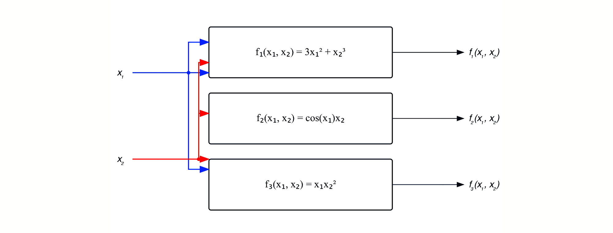

# Modern Robotics Study Notes

Kevin Lynch's book **Modern Robotics: Mechanics, Planning and Control**

Note created on: 12/13/2025

## Chapter 2 Summary

- A robot is mechanically constructed from links that are connected by various types of joint. 
  - **The links are usually modeled as rigid bodies**. 
  - An **end-effector** such as a gripper may be attached to some link of the robot. 
  - The **Actuators** (like servos) deliver forces and torques to the joints, thereby causing motion of the robot.
- [Types of joints](#22-dof-of-a-robot):
  - **The most widely used 1-DOF joints are the revolute joint**, which allows rotation about the joint axis, and the prismatic joint, which allows translation in the direction of the joint axis. 
  - Some common two-DOF joints include the cylindrical joint, which is constructed by serially connecting a revolute and prismatic joint, and the universal joint, which is constructed by orthogonally connecting two revolute joints. 
  - The spherical joint is a 3-DOF joint whose function is similar to the human shoulder joint.
- **The [configuration of a rigid body](#21-dof-of-a-rigid-body) is a specification of the location of all its points**. 
  - For a rigid body moving in the plane, **3** independent parameters are needed to specify the configuration. 
  - For a rigid body moving in three-dimensional space, **6** independent parameters are needed to specify the configuration. 
- The number of degrees of freedom of a robot can be calculated using [Grubler’s formula](#grublers-formula). 
- A robot’s [C-space](#23-topology-and-representation) be **parametrized explicitly** or **represented implicitly**.
  - For a robot with $n$ degrees of freedom, an [explicit parametrization](#explicit-parametrization) uses $n$ coordinates, the minimum necessary. 
  - An [implicit representation](#implicit-representation) involves m coordinates with $m \ge n$, with the $m$ coordinates subject to $m - n$ constraint equations. 
  - With an implicit parametrization, a robot’s C-space can be viewed as a surface of dimension $n$ embedded in a space of higher dimension $m$.
- The C-space of an $n$-DOF robot whose structure contains one or more closed loops can be implicitly represented using $k$ loop-closure equations of the form $g(\theta) = 0$. Such constraints equations are called [holonomic constraints](#holonomic-constraints). 
- Assuming that $\theta$ varies with time $t$, the [holonomic constraints](#holonomic-constraints) $g(\theta(t)) = 0$ can be differentiated to yield the robot’s velocity constraints $\frac{\partial g}{\partial \theta}(\theta)(\dot{\theta}) = 0$.  
- A robot’s motion can also be subject to velocity of the [Pfaffian form](#pfaffian-constraints): $A(\theta)\dot{\theta} = 0$. 
  - **Integrable Pfaffian constraints can be integrated into holonomic constraints**. 
  - **Non-integrable Pfaffian constraints are called [non-holonomic constraints](#non-holonomic-constraints).** These constraints reduce the dimension of feasible velocities of the system but do not reduce the dimension of the reachable C-space. 
  - Non-holonomic constraints arise in robot systems subject to conservation of momentum or rolling without slipping.
- A robot’s [task space](#25-task-space-and-workspace) is a space in which the **robot’s task can be naturally expressed**. A robot’s workspace is a specification of the configurations that the **end-effector of the robot can reach**.

## Chapter 2: C-Space

Definitions: 

- The **configuration of a robot** is a complete **specification** of the position of every point of the robot.
- The **number of DOF** is minimum number of real-valued (independent) coordinates that represent the configuration.
- The **Configuration Space (C-Space)** is the #-dimensional space that contains all of the robot's configuration. 

### 2.1 DOF of a rigid body

**number of DOF = sum(freedoms of points) - (number of independent constraint)**

- General Rule: The Dimension of the C-Space or the # of DOF equals the sum of the freedoms of the points minus the number of independent constraints acting on those points. 

- For just rigid bodies (applied to this course): 

​	$\text{number of DOF} = \sum(\text{freedoms of bodies}) - (\text{number of independent constraints})$ 

- A planar rigid body has 3 DoF, and **a spatial rigid body has 6 DOF**:

- **The # of DOF** 

​	= **the dimension of its C-Space** 

​	= the # of real numbers needed to specify its configuration

​	= sum(freedoms of bodies) - (# of independent constraint)

- **A rigid body in n-dimensional space has m total degrees of freedom. How many of these m degrees of freedom are angular (not linear)?**

  - `m-n`

    n linear coordinates specify the location of one point of the rigid body, and the remaining m - n coordinates are subject to radius constraints, and hence as angular coordinates

  - `n(n-1)/2`

    The general formula for calculating # of angular DOF, so it's equivalent to `m-n`

### 2.2 DOF of a Robot

| Joint Type      | DOF (f_i) | Constraints btwn two planar rigid bodies (c_i) | Constraints btwn two spatial rigid bodies (c_i) |
| --------------- | --------- | ---------------------------------------------- | ----------------------------------------------- |
| Revolute (R)    | 1         | 2                                              | 5                                               |
| Prismatic (P)   | 1         | 2                                              | 5                                               |
| Helical (H)     | 1         | N/A                                            | 5                                               |
| Cylindrical (C) | 2         | N/A                                            | 4                                               |
| Universal (U)   | 2         | N/A                                            | 4                                               |
| Spherical (S)   | 3         | N/A                                            | 3                                               |

#### Grubler's formula

- determining the number of degrees of freedom of a robot, simply by counting the number of rigid bodies and joints. 

- As we already known:

  $\text{number of DOF} = \sum(\text{freedoms of bodies}) - (\text{number of independent constraints})$ 

  

- All constraints must be independent, otherwise this formula fails

  $\text{DOF} = \underbrace{m(N-1)}_{\text{rigid body freedoms}} - \underbrace{\sum_{i=1}^{J} c_i}_{\text{joint constraints}}
  \newline
  = m(N-1)-\sum_{i=1}^{J}(m-f_i)
  \newline
  = m(N-1-J)+\sum_{i=1}^{J}(f_i)$ 

$N$ = # of bodies, including ground 

​	(**the ground always counts as one single rigid body**, no matter how many connection it has with the robot)

$J$ = # of joints 

​	(**a single joint can only connect two rigid bodies**, so if there's more than two on one body, there must be more than one joint there)

$m$ = **6 for spatial bodies**, **3 for planar bodies**, 10 for 4-D bodies

​	(constant, the # of C-space dimension)

$f_i$ = the number of freedoms provided by joint i 

​	**(count how many each type of joints there are, then sum their DoFs)**

$c_i$ = the number of constraints provided by joint i

$c_i$ + $f_i$ = $m$ for all i

- If Grubler's formula counts 0 or negative:

  **the constraints implied by the joints may be independent** or the mechanism is incapable of motion. 

#### Example Calculation

m = 6, N = 10, J = 12

sum(f_i) = 7 * 4 = 28

Using [Grubler's formula](#grublers-formula): DOF = 6(10 - 1 - 12) + 28 = 10

**if there're n arms**: DOF = 6(2+2n-1-3n)+7n = n+6

**if the revolute joints are replaced by universal joints**: m, N, J stays the same; sum(f_i) = 8n; DOF = 6(2+2n-1-3n) +8n = 2n+6

### 2.3 Topology and Representation

- **two spaces are topologically equivalent if one can be continuously deformed into the other without cutting or gluing.** 
- Distinct one-dimensional spaces: 
  - **the circle** $S$ or $S^1$ (meaning a 1-D sphere)
  - **the line** $E$ or $E^1$ (meaning a 1-D Euclidean, flat space)
    - an open interval of the line $(a,b)\subset R^1$ is topologically equivalent to $E^1$ if stretched
  - **a closed interval of the line** $[a,b]\subset R^1$ ($R^1$ means a point on the line; line includes the endpoints $a,b$)
- In higher dimensions:
  - $R^n$ is the $n$-dimensional Euclidean space
  - $S^n$ is the $n$-dimensional surface of a sphere in an $(n+1)$-dimensional space (e.g. $S^2$ is the 2-D surface of a sphere in a 3-D space)
- The topology of a space is **a fundamental property of the space** itself.
- The topology of a space is **independent of how we choose coordinates** to represent points in the space (e.g. ($x,y$) with constraint $x^2+y^2=1$) 

#### C-space as Cartesian Product 

- Used to represent a C-space with two or more spaces of lower dimension.

- ==a rigid body in the plane is $R^2\times S^1$==: the concatenation of a 2D coordinate (x,y) and an angle $\theta$ representing $S^1$.

- ==a rigid body in the 3D space is $R^3 \times S^2 \times S^1$==.  

  > Note that $S^n \times S^1 \neq S^{n+1}$.

  - a point in $R^3$, plus a point on a two-dimensional sphere $S^2$, plus a point on a one-dimensional circle $S^2$.

- a PR (Prismatic + Revolute) robot arm is $R^1 \times S^1$. 

  - if mounted on a planar rigid body, the C-space is $(R^2 \times S^1) \times (R^1\times S^1) = R^2 \times T^2$. 
  - if mounted on a spatial rigid body, the C-space is $(R^3 \times S^2 \times S^1) \times (R^1\times S^1) = R^4 \times S^2 \times T^2$.

- a RR robot arm is ==$S^1 \times S^1 = T^2$==. 

  > Note that $T^n \times S^1 = T^{n+1}$.

#### Numerical representation of C-Space 

##### Explicit parametrization

- minimum number of coordinates 

- simplicity, but may have poor behavior because the space change

- **Example: to represent the C-space of the surface of a sphere** (pendulum with one fixed end)

  - Explicit: [-90º, 90º] for latitute, [-180º, 180º] for longitude
    - near north and south pole, a very small step gives large changes in coordinates
    - near equator, a large step gives small changes in coordinates
    - the north and south pole are **sigularities** of the representation, loss of dimension, which is problematic

- How to avoid the singularity problem?

  - A. Use **more than one coordinate chart** on the space, each covering only a portion of the space
    - form an **atlas** with multiple charts: always uses the minimum number of numbers

  - B. Use implicit parametrization

##### Implicit representation

Make a surface embedded in a higher-dimensional space. (the major perametrization in this book)

- Implicit parametrization of a 2D sphere surface in 3D space: $(x,y,z)$ with constraint $x^2+y^2+z^2=1$ 
- Advantage: Best for curved shape. No singularies. No need for multiple coordinate charts, hence no atlas
- **For robots containing one or more closed loops**, usually an implicit representation is more easily obtained than an explicit parametrization.
- Drawback: the representation has more numbers than the number of DOF

**Implicit representation of a rigid body in space**

- **the rotation matrix**: 9 numbers, subject to 6 constraints (in a 9-6=3 dimension space)
- able to use linear algebra to perform roation or change of reference frame

### 2.4 Configuration and Velocity Constraints

This four-bar linkage can be viewed as a serial chain with 4 revolute joints that:

​	(1) the top of linnk $L_4$ always coincides with the origin

​	(2) the orientation of $L_4$ is always horizontal. 

> Based on [Grubler's formula](#grublers-formula), we knew this mechanism has **1 DOF** in 2D space. 

- Dimensional space: 4-D space

  $ \boldsymbol{\theta} = \begin{bmatrix} \theta_1 \\ \theta_2 \\ \theta_3 \\ \theta_4 \end{bmatrix} \in \mathbb{R}^4 $   

- The **absolute angles** of each linkage:

  - angle of L1: $\theta_1$ 
  - angle of L3: $\theta_1+\theta_2$ 
  - angle of L4: $\theta_1+\theta_2+\theta_3$ 
  - angle of L5: $\theta_1+\theta_2+\theta_3+\theta_4$ 

- **The X-axis constraint** (for position):

  > knowing that x-axis component $x = L\cdot cos(\theta)$ and the linkage have no horizontal movement (=0)
  >
  > L = distance travelled

  (1) $L_1 \cos\theta_1 + L_2 \cos(\theta_1 + \theta_2) + \dots + L_4 \cos(\theta_1 + \dots + \theta_4) = 0$ 

- **The Y-axis constraint** (for position): 

  > knowing that y-axis component $y = L\cdot sin(\theta) $ and the linkage have no vertical movement (=0)

  (2) $L_1 \sin\theta_1 + L_2 \sin(\theta_1 + \theta_2) + \dots + L_4 \sin(\theta_1 + \dots + \theta_4) = 0$ 

- **The angular constraint** (for orientation):

  > Because both ends are on the ground, the sum of angles is a whole loop $2\pi$

  (3) $\theta_1 + \theta_2 + \theta_3 + \theta_4 - 2\pi = 0$ 

- (1), (2), (3) are referred to as the **loop-closure equations**

  - Exist in a four joint space AKA **a 4D space** : ($\theta_1, \theta_2, \theta_3, \theta_4$)
  - **there're 3 equations, but have 4 unknowns**, meaning the system is not locked, and has 1 DOF
  - Hence **the C-space of this 4-bar linkage is just a one-dimensional curve** in a 4-dimensional joint space.

- Thus, the 4-bar linkage can be represented by 4 dimensional joint space (in the form of column vector below) subject to 3 loop constraints.

#### Holonomic Constraints

**In general scenario**: 

- we have a robotic mechanism that has a set of close-loop equations $\bar{g}(\bar{\theta})$ with vector input $$ \boldsymbol{\bar{\theta}} = \begin{bmatrix} \theta_1 \\ \theta_2 \\ ... \\ \theta_n \end{bmatrix} \in \mathbb{R}^n $$ 
- We can **represent the mechanism’s ==holonomic constraints== by a [Jacobian Matrix](#supplement-2-jacobian-matrix) of its Close-loop equations**.  

​	$$\bar{g}(\bar{\theta}) = \begin{bmatrix} g_1(\theta_1, \ldots, \theta_n) \\ \vdots \\ g_k(\theta_1, \ldots, \theta_n) \end{bmatrix} = 0,\ k \le n ,\ g(\theta) \in \mathbb{R}^n$$ 

​	$n$ = total variables (dimension of the joint space)

​	$k$ = number of holonomic constraints

- The holonomic constraints properties:

  - All holonomic constraints must be in the form of something = 0 (so they’re integrable). 
  - A set of $k$ independent queations, with $k \le$ n, meaning that **holonomic constraints reduces the joint space**
  - **They constraints on only configuration** aka position 
  - C-Space Dimension: $DOF = n - k$  aka $ \text{DOF} = n - (\text{number of independent Holonomic Constraints}) $ 
  

#### Pfaffian Constraints

> About the $\dot{\theta}$ notation: 
>
> - $\theta$  = **Position** (Angle)
> - $\dot{\theta} = \frac{d\theta}{dt}$ = **velocity** (angular velocity)
> - $\ddot{\theta} = \frac{d^2\theta}{dt^2}$ = **acceleration** (angular acceleration)

- We can differentiate the holonomic constraints to obtain the mechanism’s Pfaffian constraints. The total derivative of the holonomic constraints with respect to time $t$ is the sum of the [partial derivatives](#supplement-1-partial-derivatives) for every angle $\theta$. 

- (Assuming the mechanism is in motion, following the time trajectory $\bar{\theta}(t)$. )

  **Holonomic constraints**: $$\bar{g}(\bar{\theta}) = \begin{bmatrix} g_1(\theta_1, \ldots, \theta_n) \\ \vdots \\ g_k(\theta_1, \ldots, \theta_n) \end{bmatrix} = 0,\ k \le n ,\ g(\theta) \in \mathbb{R}^n$$ 

  **Pfaffian constraints** (velocity constraints): $$\frac{d}{dt}\bar{g}(\bar{\theta}(t)) = \begin{bmatrix} \frac{\partial g_1}{\partial \theta_1}(\theta)\dot{\theta}_1 + \frac{\partial g_1}{\partial \theta_2}(\theta)\dot{\theta}_2 + \dots + \frac{\partial g_1}{\partial \theta_n}(\theta)\dot{\theta}_n\\ \vdots \\ \frac{\partial g_k}{\partial \theta_1}(\theta)\dot{\theta}_1 + \frac{\partial g_k}{\partial \theta_2}(\theta)\dot{\theta}_2 + \dots + \frac{\partial g_k}{\partial \theta_n}(\theta)\dot{\theta}_n\end{bmatrix} = 0$$ 

- Separating matrix, we got: 

​	$$\underbrace{\begin{bmatrix} \frac{\partial g_1}{\partial \theta_1}(\theta) & \dots & \frac{\partial g_1}{\partial \theta_n}(\theta) \\ \vdots & \ddots & \vdots \\ \frac{\partial g_k}{\partial \theta_1}(\theta) & \dots & \frac{\partial g_k}{\partial \theta_n}(\theta) \end{bmatrix}}_{\text{Jacobian Matrix } A(\theta)} \cdot \underbrace{\begin{bmatrix} \dot{\theta}_1 \\ \vdots \\ \dot{\theta}_n \end{bmatrix}}_{\text{Velocity Vector } \dot{\theta}} = \begin{bmatrix} 0 \\ \vdots \\ 0 \end{bmatrix}$$ 

- **The generic Pfaffian form**: $A(\theta)\dot{\theta} = 0$
  - $A(\theta)$ is the Jacobian Matrix. 
  - $\dot{\theta}$ is the velocity vector. 
- **Integrable Pfaffian constraints are holonomic constraints**: always in the form of equality, like $x^2 + y^2 - r^2 = 0$. 
- **Non-integrable Pfaffian constraints are non-holonomic constraints**: always in the form of inequality, like a range limit $z \ge 0$. 

#### Non-holonomic Constraints

- The non-integrable constraints are Jacobian Matrices that don’t exist a differentiable function $g$ that $\frac{\partial g(q)}{\partial q} = A(q)$. 

- If that is not the case, then there must be a differentiable $g_1(q)$ that satisfies the following four equalities 

  (for some $h_i, i = 1,...,4$)

  - $\frac{\partial g_1}{\partial q_1} = 1 \rightarrow g_1(q) = q_1 + h_1(q_2,q_3,q_4)$ 
  -  $\frac{\partial g_1}{\partial q_2} = 0 \rightarrow g_1(q) = h_2(q_1,q_3,q_4)$ 
  - $\frac{\partial g_1}{\partial q_3} = 0 \rightarrow g_1(q) = h_3(q_1,q_2,q_4)$ 
  - $\frac{\partial g_1}{\partial q_4} = -r\cos{q_3} \rightarrow g_1(q) = -rq_4\cos{q_3}h_4(q_1,q_2,q_3)$ 

- Non-holonomic constraints are usually associated with robotic systems that have **conservation of momentum or rolling without slipping**.

#### Non-holonomic Example

A coin of radius $r$ rolls without slipping on a plane

1. **Direction:** It must move in the direction it is pointing. This direction is given by the steering angle $\phi$ , represented by the vector ($\cos{\phi},\sin{\phi}$). 

2. **Speed:** The forward speed of the contact point on the ground must exactly match the tangential speed of the coin's rotation. If the coin rotates at a rate of $\dot{\theta}$, its tangential speed is $r\dot{\theta}$. 

3. **List velocity equations**: $\begin{bmatrix} \dot{x} \\ \dot{y} \end{bmatrix} = \begin{bmatrix} r\dot{\theta} \cos \phi \\ r\dot{\theta} \sin \phi \end{bmatrix}$ 

4. **Rearrange the equations** to include all four variables + set them to zero: 

   1. $1 \cdot \dot{x} + 0 \cdot \dot{y} + 0 \cdot \dot{\phi} - (r \cos \phi) \dot{\theta} = 0$ 
   2. $0 \cdot \dot{x} + 1 \cdot \dot{y} + 0 \cdot \dot{\phi} - (r \sin \phi) \dot{\theta} = 0$ 

5. **Covert to the Pfaffian form**: $$\begin{bmatrix} 1 & 0 & 0 & -r \cos q_3 \\ 0 & 1 & 0 & -r \sin q_3 \end{bmatrix} \begin{bmatrix} \dot{q}_1 \\ \dot{q}_2 \\ \dot{q}_3 \\ \dot{q}_4 \end{bmatrix} = \begin{bmatrix} 0 \\ 0 \end{bmatrix}, \begin{bmatrix} \dot{q}_1 \\ \dot{q}_2 \\ \dot{q}_3 \\ \dot{q}_4 \end{bmatrix} = \begin{bmatrix} \dot{x} \\ \dot{y} \\ \dot{\phi} \\ \dot{\theta} \end{bmatrix}$$

6. **Why it’s non-holonomic?** 

   - **Pure maths explanation** (which I don’t see explicitly): this function set don’t exist a differentiable function $g$ that $\frac{\partial g(q)}{\partial q} = A(q)$. 

   - **Physics setting explanation** (more intuitively viable): There’s **no coordinate constraint** for the coin! If these constraints were integrable, they would "trap" the coin on a 2D surface within its 4D configuration space. However, we know from experience that we can move a rolling object to any position $(x,y)$ with any orientation $\phi$. 

     Although we have the fixed velocity constraint $g(q,\dot{q}) = 0$,  there is no fixed algebraic relationship $g(x, y, \phi, \theta) = 0$ that always hold true. 

### 2.5 Task Space and Workspace

- Task space: the space in which the robot's task is naturally expressed. 
  - The task space depends on the task, not the robot.
- Wrokspace: a specification of the reachable configurations of the end effector. 
  - The workspace of a particular robot is independent of the task.

## Supplement 1: Partial Derivatives

> Reference
>
> 1. [Partial Derivatives and the Gradient of a Function by Professor Dave Explains - Youtube](https://youtu.be/AXH9Xm6Rbfc?si=Hi2mEpz1IyRVZb0v) 
> 2. [The Jacobian Matrix by Christopher Lum - Youtube](https://youtu.be/QexBVGVM690?si=TXnUbeAiJf-dQFwF) 

- For regular single-variable derivatives, such as $f(x) = sin(x)$, we know $\frac{df}{dx} = cos(x)\,dx$.  

- For **multi-variable derivative**, partial derivatives **treats only one variable and treats others as constant**. 

- Example: $f(x,y) = xy^2 + x^3$ 

  - Derivative with respect to x: 

    $\frac{\partial f}{\partial x} = \frac{\partial}{\partial x}(x)y^2 + \frac{\partial}{\partial x}(x^3) = y^2 + 3x^2$ 

  - Derivative with respect to y: 

    $\frac{\partial f}{\partial y} = \frac{\partial}{\partial y}x(y^2) + \frac{\partial}{\partial y}x^3 = 2xy$ 

  - Thus, the **gradient of the function is a vector made up of all the partial derivatives of the function**. 

    1. Unit vector notation: $\text{grad f} = \frac{\partial f}{\partial x}\hat{i} + \frac{\partial f}{\partial y}\hat{j} = (y^2 + 3x^2)\hat{i} + (2xy)\hat{j}$ 

    2. Vector component notation: $\text{grad f} = <\frac{\partial f}{\partial x} , \frac{\partial f}{\partial y}> = <y^2 + 3x^2 , 2xy>$ 
    3. In 3-D space, the gradient will be $\text{grad f} = \frac{\partial f}{\partial x}\hat{i} + \frac{\partial f}{\partial y}\hat{j} + \frac{\partial f}{\partial z}\hat{k}$ 

- Alternative notation for vector component notation: $\triangledown$, **del** or nobla. 

  - e.g., $\triangledown = <\frac{\partial f}{\partial x}, \frac{\partial f}{\partial y}>$ 

- Example 2: consider now a scalar function $\bar{x}$ with multiple inputs (this time in column vector notation). 

  - Given that: 

    $$\bar{x} = \begin{bmatrix} \ x_1 \\ x_2 \\ \vdots \\ x_n \end{bmatrix}$$

    $$f(x_1,x_2) = 3(x_1)^2+(x_2)^2$$

  - As the gradient of a function follows: 

    $$\triangledown f(\bar{x}) = \frac{\partial f(\bar{x})}{\partial \bar{x}} = \begin{bmatrix}\frac{\partial f(\bar{x})}{\partial x_1} \\ \frac{\partial f(\bar{x})}{\partial x_2} \\ \vdots  \\ \frac{\partial f(\bar{x})}{\partial x_n} \end{bmatrix}$$

    We can calculate: 

    $$\triangledown f(\bar{x}) = \begin{bmatrix} \ \frac{\partial f(\bar{x})}{\partial x_1} \\ \frac{\partial f(\bar{x})}{\partial x_2} \end{bmatrix} = \begin{bmatrix} 6x_1 \\ 3(x_2)^2 \end{bmatrix}$$ 

  - the $x_1$ gradient $\frac{\partial f(\bar{x})}{\partial x_1}$ is the **sensitivity of the function** $f(\bar{x})$ **to change in** $x_1$. 

  -  the $x_2$ gradient $\frac{\partial f(\bar{x})}{\partial x_2}$ is the **sensitivity of the function** $f(\bar{x})$ **to change in** $x_2$. 

- Property of the gradient:

  1. The gradient points in the **direction of maximum change**. 
  2. Its magnitude is equal to the maximum rate of change. 

## Supplement 2: Jacobian Matrix 

> Reference: [The Jacobian Matrix by Christopher Lum - Youtube](https://youtu.be/QexBVGVM690?si=TXnUbeAiJf-dQFwF) 

- A Jacobian Matrix is a giant matrix of **all the gradients** (mixed partial derivatives) **stacked on top of each other**, of the scalar functions in the **vector function**. 
- A vector function ( $\bar{f}$ ) is basically multiple scalar functions ( $f_1,f_2,f_3...$ ) stacked on top of each other (like the diagram above). 
- The Jacobian Matrix uses **row vectors** for every function inside. 

- $$J = \frac{\partial \bar{f}}{\partial \bar{x}} = \begin{bmatrix} \triangledown f_1(\bar{x})^T \\ \triangledown f_2(\bar{x})^T \\ \vdots \\ \triangledown f_m(\bar{x})^T \end{bmatrix} = \begin{bmatrix} \frac{\partial f_1(\bar{x})}{\partial x_1} & \frac{\partial f_1(\bar{x})}{\partial x_2} & \dots & \frac{\partial f_1(\bar{x})}{\partial x_n} \\ \frac{\partial f_2(\bar{x})}{\partial x_1} & \frac{\partial f_2(\bar{x})}{\partial x_2} & \dots & \frac{\partial f_2(\bar{x})}{\partial x_n} \\ \vdots & \vdots & \ddots & \vdots \\ \frac{\partial f_m(\bar{x})}{\partial x_1} & \frac{\partial f_m(\bar{x})}{\partial x_2} & \dots & \frac{\partial f_m(\bar{x})}{\partial x_n}\end{bmatrix}$$ 

- $J_{ij} =$ **the sensitivity of function $\bar{f}$ ’s $i^{\text{th}}$ output to change in $x_j$.**  

Practice Example: 

- $$\bar{f}(\bar{x}) = \begin{bmatrix} 3(x_1)^2 + (x_2)^3 \\ cos(x_1)x_2 \\ x_1(x_2)^2\end{bmatrix}$$ 

- Outlining gradient of the vector function $\bar{f}(\bar{x})$, we got a 3x2 matrix:  

  $$J(\bar{x}) = \frac{\partial \bar{f}}{\partial \bar{x}} = \begin{bmatrix} 6x_1 & 3(x_2)^2 \\ -x_2\sin(x_1) & cos(x_1) \\ (x_2)^2 & 2x_1x_2 \end{bmatrix}$$ 

> Further reading: Chain Rule in matrix form for multi-variable system. 

