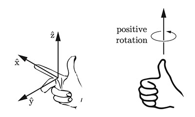
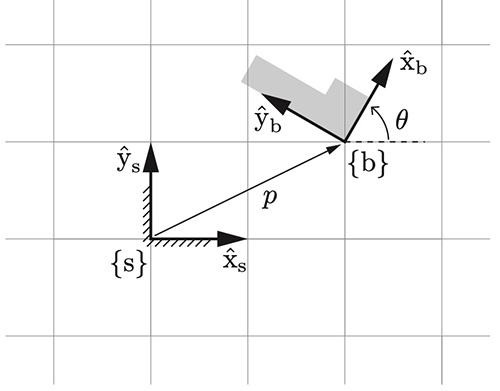
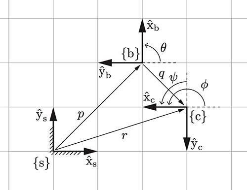
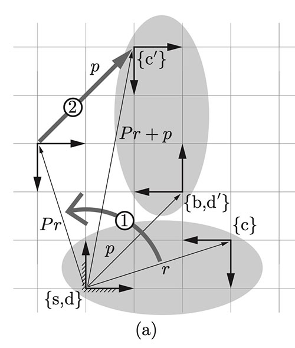

## Chapter 3: Rigid-Body Motions

- The **reference frame is an implicit representation of the C-space** of a rigid body
- By attaching a reference frame to a rigid body, the frame **describes the body's position and orientation in a 4x4 matrix**.
- Rigid body's velocity: $R^6$, called **spatial velocity or twist**, contains 3 angular velocities and 3 linear velocities. 
- Rigid body's force: $F^6$, called spatial force or wrench, contains moments (torques) and forces. 

Vector Notations

- ==$v\ $==$ \in R^n$: the representation of a free vector on the choice of coordinate frame. 
  - **Free vectors**, noted as ==v==: an arrow, a geometric quantity contains only length and direction information. E.g., linear velocity is speed + direction.

- Point vectors, noted as $p \in R^n$, the representation of a vector point on the choice of coordinate frame. 
  - a coordinate-free vector point is noted as **p**. E.g., p $= (1,2)$
  - a point vector with unit coordinate axes $\hat{x}_a$ and $\hat{y}_a$ is $p_a = (1,2)$

- **All frames in this book are stationary**, inertial, frames. 

- All reference frames are **right-handed**. 

  

- We assume **exactly one stationary fixed-frame**, or space frame, {s} for a robotic system.

  - a single, universally agreed-upon reference point and orientation for the entire robotic system and its environment.

- The body frame, {b}, is a motionless frame that is instantaneously coincident with a frame that is fixed to a (possibly moving) body.

### 3.1 Rigid-Body Motions in the Plane

#### Example 1

- In the **fixed-frame coordinate {s}** (unit axes $\hat{x}_s$ and $\hat{y}_s$), the **body frame {b}** is expressed by the vector $p$ and the direction of the unit axes $\hat{x}_b$ and $\hat{y}_b$. 

- $p = (2,1)$ $\theta = 60\degree$, so $\hat{x}_b = (\cos{\theta},\sin{\theta}) = (1/2,\sqrt{3}/2)$,  $\hat{y}_b = (cos{(\theta+90\degree)},\sin{(\theta+90\degree)}) = (-\sin{\theta},\cos{\theta}) = (-\sqrt{3}/2,1/2)$. 

- Describing the point $p$: 

  $p = p_x\hat{x}_s + p_y\hat{y}_s$, 

  or simply $p = (p_x,p_y)$.

- **Describing the body frame {b}** after specifying the angle $\theta$: 

  - Simple way: 

    {b}  = (rotation matrix, point vector)

    E.g., {b} $= (P,p)$

  - Detailed way: 

    $\hat{x}_b = (\cos{\theta}\hat{x}_s,\sin{\theta}\hat{y}_s)$,

    $\hat{y}_b = (-\sin{\theta}\hat{x}_s,\cos{\theta}\hat{y}_s)$.

#### Example 2

- the point p can be represented as vector $p \in R^2$  as $p = \begin{bmatrix} p_x \\ p_y\end{bmatrix}$. 
- The frame **{b} in fixed-space frame {s}** is given by $(P,p)$. 
  - $p$ is the **origin of frame {b} as seen from frame {s}**.
  - $P$ or $P_{sb}$ is a **rotation matrix parametrized by $\theta$**, it transforms vectors from frame {b} to frame {s}. 
  - $P = \begin{bmatrix} \hat{x}_b & \hat{y}_b \end{bmatrix} = \begin{bmatrix} \cos{\theta} & -\sin{\theta} \\ \sin{\theta} & \cos{\theta} \end{bmatrix}$.
- Similarly, the frame **{c} in {s}** is given by $(R, r)$.
  - $r$ is the **origin of frame {c} as seen from frame {s}**.
  - $R$ is a **rotation matrix** parametrized by $\phi$, it transforms vectors from frame {c} to frame {s}. 
  - $r = \begin{bmatrix} r_x \\ r_y\end{bmatrix}, R = \begin{bmatrix} \hat{x}_c & \hat{y}_c \end{bmatrix} = \begin{bmatrix} \cos{\phi} & -\sin{\phi} \\ \sin{\phi} & \cos{\phi} \end{bmatrix}$

- We can represent the frame **{c} in {b}**, given by $(Q,q)$
  - $q$ is the **origin of frame {c} as seen from frame {b}**.
  - $Q$ is a **rotation matrix** parametrized by $\psi$, it transforms vectors from frame {c} to frame {b}. 
  - $q = \begin{bmatrix} q_x \\ q_y\end{bmatrix}, Q = \begin{bmatrix} \cos{\psi} & -\sin{\psi} \\ \sin{\psi} & \cos{\psi} \end{bmatrix}$

- We can also **compute the configuration of {c} relative to {s}** using $(Q,q)$ and $(P,p)$: 
  - ==$R = PQ$==: convert rotation matrix Q to the {s} frame, basically $\phi = \theta + \psi$. 
  - ==$r = Pq + p$==: convert $q$ to the {s} frame and vector-sum with $p$.
    - Explaining this equation $r = Pq + p$: 
      1. $P$ is the function that transforms anything in frame{b} to frame {s}.
      2. $q$ means marking the origin of {c} in frame{b}.
      3. $P\times q$ still means marking the origin of {c} in frame{b}, but expressed in frame{s}. 
      4. $p$ means marking the origin of frame{b} in frame{s}.
      5. Now, because $Pq$ and $p$ are both expressed in frame{s}, adding them together gives $r$, the origin of frame{c} as seen from frame {s}. 

#### Example 3

- **A rigid body has two frames attached to it {d} and {c}**

  - frame{d} is initially coincident with the fixed-space frame{s}. 
  - frame{c} is described by $(R,r)$ in {s}. 

- The rigid body is then moved in a way that:

  - {d} moves to {d'}. 

  - {d'} is coincident with frame{b}, which is described by $(P,p)$ in {s}.

  - {c} moves to {c'} = $(R',r')$

  - ==$R' = PR$== ,

    ==$r' = Pr + p$==.

- This is called a ==**rigid-body displacement**/motion==.

#### Rotation matrix-vector pair

The rotation matrix-vector pair, such as $(P,p)$, can be used for **3 purposes**:

1. to represent a configuration of a rigid body in frame{s}. (Example 1)
2. to change the reference frame in which a vector or frame is represented. (Example 2)
3. to displace a vector or a frame. (Example 3)

### 3.2.1 Rotation matrices

**Special Orthogonal Group SO(3)** is the set of all 3x3 real matrices R satisfying:

- $R^T R = I$: the columns (and rows) of $R$ form an orthonormal basis
- $\det(R) = 1$: the determinant of $R$ = 1 (not -1), **right handed**

#### SO(3) group properties

- 

## Supplement 1: Integrability

- 