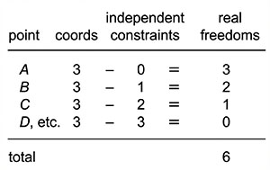
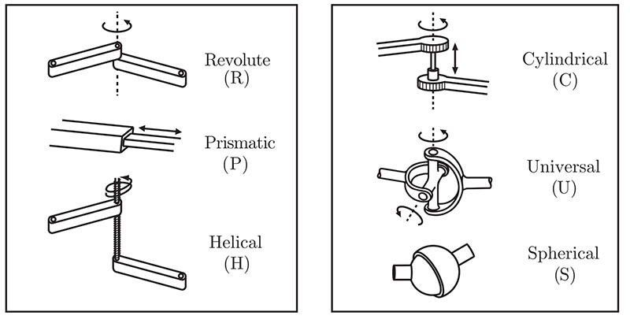
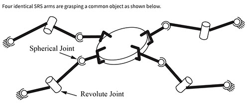
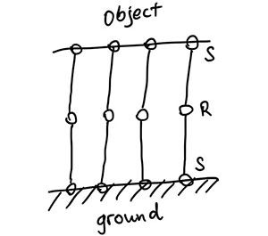
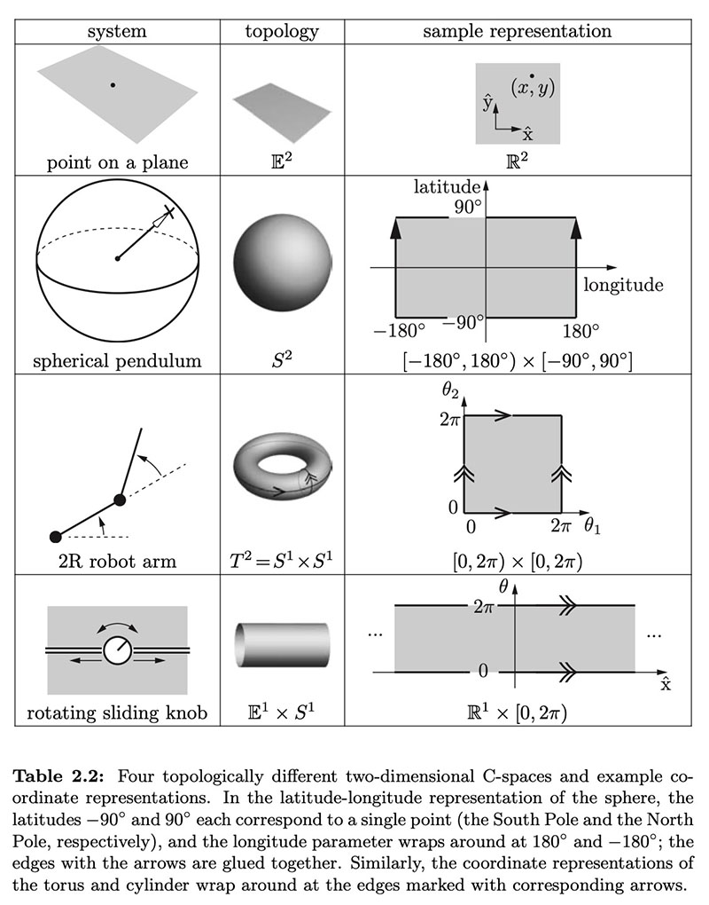

# Modern Robotics Study Notes

Kevin Lynch’s book **Modern Robotics: Mechanics, Planning and Control**

Note created on: 12/13/2025

Last edit: 12/13/2025

## Chapter 2 C-Space

Definitions: 

- The **configuration of a robot** is a complete **specification** of the position of every point of the robot.
- The **# of DoF** is minimum number of real-valued (independent) coordinates that represent the configuration.
- The **Configuration Space (C-Space)** is the #-dimensional space that contains all of the robot’s configuration. 

### 2.1 DoF of a rigid body

**# of DoF = sum(freedoms of points) - (# of independent constraint)**

- General Rule: The Dimension of the C-Space or the # of DoF equals the sum of the freedoms of the points minus the number of independent constraints acting on those points. 

- For just rigid bodies (applied to this course): 

​	$\text{\# of dof} = \sum(\text{freedoms of bodies}) - (\text{\# of independent constraints})$

- A planar rigid body has 3 DoF, and **a spatial rigid body has 6 DoF**:

- **The # of DoF** 

​	= **the dimension of its C-Space** 

​	= the # of real numbers needed to specify its configuration

​	= sum(freedoms of bodies) - (# of independent constraint)

- **A rigid body in n-dimensional space has m total degrees of freedom. How many of these m degrees of freedom are angular (not linear)?**

  - `m-n`

    n linear coordinates specify the location of one point of the rigid body, and the remaining m - n coordinates are subject to radius constraints, and hence as angular coordinates

  - `n(n-1)/2`

    The general formula for calculating # of angular DoF, so it’s equivalent to `m-n`

### 2.2 DoF of a Robot

| Joint Type      | DoF (f_i) | Contraints btwn  two planar rigid bodies (c_i) | Contraints btwn  two spatial rigid bodies (c_i) |
| --------------- | --------- | --------------------------------------------------- | ---------------------------------------------------- |
| Revolute (R)    | 1         | 2                                                   | 5                                                    |
| Prismatic (P)   | 1         | 2                                                   | 5                                                    |
| Helical (H)     | 1         | N/A                                                 | 5                                                    |
| Cylindrical (C) | 2         | N/A                                                 | 4                                                    |
| Universal (U)   | 2         | N/A                                                 | 4                                                    |
| Spherical (S)   | 3         | N/A                                                 | 3                                                    |

#### Grübler’s formula

- determining the number of degrees of freedom of a robot, simply by counting the number of rigid bodies and joints. 

- As we already known:
  
  $\text{\# of dof} = \sum(\text{freedoms of bodies}) - (\text{\# of independent constraints})$
  
  
  
- All constraints must be independent, otherwise this formula fails

  $\text{\# of dof} = \underbrace{m(N-1)}_{\text{rigid body freedoms}} - \underbrace{\sum_{i=1}^{J} c_i}_{\text{joint constraints}}
  \newline
  = m(N-1)-\sum_{i=1}^{J}(m-f_i)
  \newline
  = m(N-1-J)+\sum_{i=1}^{J}(f_i)$

$N$ = # of bodies, including ground 

​	(**the ground always counts as one single rigid body**, no matter how many connection it has with the robot)

$J$ = # of joints 

​	(**a single joint can only connect two rigid bodies**, so if there’s more than two on one body, there must be more than one joint there)

$m$ = **6 for spatial bodies**, **3 for planar bodies**, 10 for 4-D bodies

​	(constant, the # of C-space dimension)

$f_i$ = the number of freedoms provided by joint i 

​	**(count how many each type of joints there are, then sum their DoFs)**

$c_i$ = the number of constraints provided by joint i

$c_i$ + $f_i$ = $m$ for all i

- If Grubler’s formula counts 0 or negative:

  **the constraints implied by the joints may be independent** or the mechanism is incapable of motion. 

#### Example Calculation

m = 6, N = 10, J = 12

sum(f_i) = 7 * 4 = 28

DoF = 6(10 - 1 - 12) + 28 = 10

**if there’re n arms**: DoF = 6(2+2n-1-3n)+7n = n+6

**if the revolute joints are replaced by universal joints**: m, N, J stays the same; sum(f_i) = 8n; DoF = 6(2+2n-1-3n) +8n = 2n+6

### 2.3 Topology and Representation

- **two spaces are topologically equivalent if one can be continuously deformed into the other without cutting or gluing.** 
- Distinct one-dimensional spaces: 
  - **the circle** $S$ or $S^1$ (meaning a 1-D sphere)
  - **the line** $E$ or $E^1$ (meaning a 1-D Euclidean, flat space)
    - an open interval of the line $(a,b)\subset R^1$ is topologically equivalent to $E^1$ if stretched
  - **a closed interval of the line** $[a,b]\subset R^1$ ($R^1$ means a point on the line; line includes the endpoints $a,b$)
- In higher dimensions:
  - $R^n$ is the $n$-dimensional Euclinean space
  - $S^n$ is the $n$-dimensional surface of a sphere in an $(n+1)$-dimensional space (e.g. $S^2$ is the 2-D surface of a sphere in a 3-D space)
- The topology of a space is **a fundamental property of the space** itself.
- The topology of a space is **independent of how we choose coordinates** to represent points in the space (e.g. ($x,y$) with constraint $x^2+y^2=1$)

#### C-space as Cartesian Product 

- Used to represent a C-space with two or more spaces of lower dimension
- a rigid body in the plane is $R^2\times S^1$: the concatenation of a 2D coordinate (x,y) and an angle $\theta$ representing $S^1$
- a PR (Prismatic + Revolute) robot arm is $R^1 \times S^1$: note the joints may have travel bounds
- a RR robot arm is $S^1 \times S^1 = T^2$: 

#### C-Space representation

- **Explicit parametrization**: minimum number of coordinates 
  - simplicity, but may have poor behavior because the space change
  - e.g. latitute, longitude to reprensent a sphere.
- **Implicit parametrization**: a surface embedded in a higher-dimensional space 
  - Best for curved shape
  - e.g. $(x,y,z)$ with constraint $x^2+y^2+z^2=1$ to represent a sphere.

