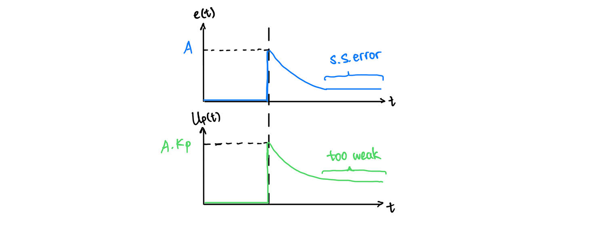
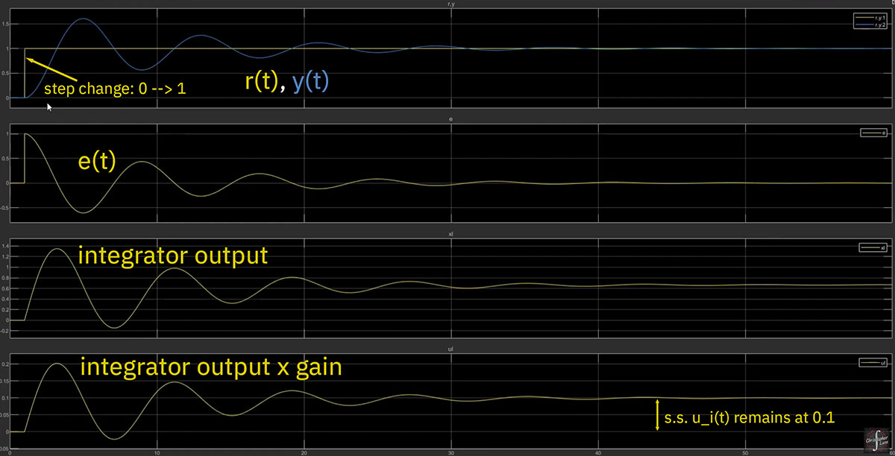

# PID Controller

Notes created on 12/25/2025


> A block diagram of a PID controller in a **feedback loop**. (source: Wikipedia)

- Input reference signal $r(t)$ 
- Error signal $e(t) = r(t) - y(t)$ 
- Control signal $u(t)$ 
- Output signal $ y(t) $ 
- Controller gain $K_p,K_i,K_d$ 

- Goal: $e(t) \rarr 0$, $ y(t) $ matches $r(t)$


### Control Law

$u(t) = K_p \cdot e(t) + K_i \cdot \frac{1}{s} \text{(Integrator)} \cdot e(t) + K_d \cdot s \text{(differentiator)} \cdot e(t)$ 

$ u(t) = \underbrace{K_p \cdot e(t)}_{u_p(t)} + \underbrace{K_i \cdot \int_{0}^{t} e(\tau)d\tau}_{u_i(t)} + \underbrace{K_d \cdot \frac{de(t)}{dt}}_{u_d(t)} $ 


### 1. Proportional Control (P)



- The larger the error, the stronger the control signal $U_p(t)$
- Provides stability against small disturbances, but insufficient for dealing with a steady disturbance (leaves a steady-state error 稳态误差)
  - most systems leaves a non-zero s.s. error with only the P controller

- Think of the P Controller as a **rubber band** connecting a weight’s actual position and the target position. 

  - The stiffness of the rubber band is the Proportional Gain $K_p$. 

  - The rubber band oscillates up and down until it settles at a point where the rubber band is stretched *just enough* to counteract gravity. That stretch is the steady-state error. 

  - Ideally, the larger $K_p$, the smaller the steady-state error: $e_{ss} \approx \frac{1}{1 + K_p}$. 

  - However, high gain causes violent oscillation and the system will be unstable. 


### 2. Integral Control (I)


- The main controlling force
- **Eliminates the steady-state error**
  - If a non-zero s.s. error exists, the control signal $u_i(t)$ will increase towards infinity! 
- However, it overshoots! The error signal will **oscillate** above and below zero until it reaches the zero s.s. error. 


### 3. Derivative Control (D)


- The **damper of the system**, reducing oscillations. 
- The more dynamic the error signal $e(t)$ is, the larger its rate of change $\frac{de(t)}{dt}$ is, so the stronger the D control signal $K_d \cdot \frac{de(t)}{dt}$ is. 
- When the error reaches steady-state (flat), no matter zero or non-zero, the D control signal becomes zero too. 


## Practical Implementations

### 1. Amplified noise in pure derivative $s$

- ⚠️ With just **a standalone pure derivative** $[s]$ , **any noise will be amplified and it corrupts the output signal**. 
  - D controller output $u_d(t) = K_d \cdot s \cdot e(t) \text{(Laplace domain)} = K_d \cdot \frac{de(t)}{dt} \text{(pure derivative form)}$ 
  - ⛔️ Predictive (forward), **non-causal derivative**:  $\dot{e}(k) = \frac{e(k+1) - e(k)}{T}$, $T$ is the small time step. However, $e(k+1)$ is in the future, we don’t know. 
  - ✅ Approximate (backward), **causal derivative**: $\dot{\tilde{e}}(k) = \frac{e(k)-e(k-1)}{T}$. We use the known prior time fraction instead. 
- Real-life scenario: $\dot{\tilde{e}}(k) = \frac{e(k)-e(k-1) + n(k)}{T} = \frac{e(k)-e(k-1)}{T}+\frac{n(k)}{T}$, $n(k)$ is the amount of random noise in the time fraction.
  - **The smaller the time fraction $T$, the more amplified the noise $\frac{n(t)}{T}$ is.** 

- Best robust practice: adding built-in **low-pass filters** $\frac{a}{s+a}$. 

  - $a$ is the cutoff frequency, $s$ is the pure derivative. 
  - At low frequency (mostly the derivative we want): $s \approx 0$, so $ \frac{a}{0 + a} = \frac{a}{a} = 1 $. 
  - At high frequency (mostly the noise): $s \approx 1$, so $ \frac{a}{\infty + a} \approx \frac{a}{\infty} \approx 0 $. 

- $u_d(t) = K_d \cdot s \cdot e(t) \cdot \frac{a}{s+a} = K_d \cdot e(t) \cdot \frac{as}{s+a}$. 

  - $\frac{as}{s+a}$ is a **pseudo derivative**, turning the input signal $e(t)$ into an approximate derivative $\dot{\tilde{e}}$. 

    

- Daisy chaining several low-pass filters: $u_d(t) = K_d \cdot e(t) \cdot \frac{as}{s+a} \cdot \frac{s}{s+a} \cdot \frac{s}{s+a}... = K_d \cdot e(t) \cdot \frac{as}{s+a} \cdot (\frac{s}{s+a})^n$ can further clean-up the noise. 

  - ⚠️ Adding low-pass filters introduce **phase lags**, especially when there’re multiple low-pass filters and the frequency is high (e.g. $\omega = 50$). 

    

- Using pseudo derivative $\frac{as}{s+a}$ also can avoid infinite $U_d(t)$ output when there’s a **step change** in the reference signal $r(t)$. 
  - Example: a user adjusts the oven temperature from 120ºC to 140ºC. ⚠️ Pure derivative $s = \infin$, but $\frac{as}{s+a}$ won’t. 


### 2. Integrator wind-up

- Recalling from section [Integral Control](# 2. Integral Control (I)), a pure integrator always **overshoots the system** $y(t)$ after reaching the set point $ r(t)$ and drives the systems beyond $ r(t)$. The system $y(t)$ will **oscillate** back and forth of $ r(t)$ until it eventually matches $ r(t)$. 
- At the steady-state, the difference in positive error & negative error is exactly what’s needed to hold the system at the set point. 
  - In another word: In systems that have external load, ==$u_i(t)$ will stay at a non-zero steady-state to balance the external load.==
  - when $e(t) = 0$: 
    - P controller’s $u_p(t) = 0$, 
    - Derivative controller’s $u_d(t) = 0$, 
    - **$u_i(t)$ is the only controlling factor remains**. 
  - External load examples gravity, heat loss, air friction etc. 

- Example: spring-mass damper model

  -  Goal: to move the block from [0,0] to [1,0], aka to move it 1 meter to the right. 

  - ```matlab
    clear
    clc
    close all
    
    m = 2; %block mass
    k = 0.1; %spring constant
    c = 0.05; %damping ratio
    
    A = [0 1;-k/m -c/m];
    B = [0;1/m];
    C = [1 0];
    D = [0];
    
    x0 = [0;0]; %block starting pisition velocity
    
    KP = 1.2;
    KI = 0.15;
    KD = 0.6;
    
    deltaTMax = 0.05;
    ```

  - 

 

- ==As long as the integral gain $K_i$ is non-zero==, $u_i$ will eventually drive the system to the zero s.s. 


## Reference

- [Introduction to PID Control by Christopher Lum - Youtube](https://www.youtube.com/watch?v=_VzHpLjKeZ8)

- [Practical Implementation Issues with a PID Controller by Christopher Lum - Youtube](https://youtu.be/yr6om0e0oAQ?si=rU-oW-7QXwFinE3-)

- [从本质上理解PID控制器，告别盲目调参 - Bilibili](https://www.bilibili.com/video/BV1NgnfzVERK/?share_source=copy_web&vd_source=70cc022a94cbbf6c817dca0ce94573e0)
- [Proportional–integral–derivative controller - Wikipedia](https://en.wikipedia.org/wiki/Proportional–integral–derivative_controller)
- 


