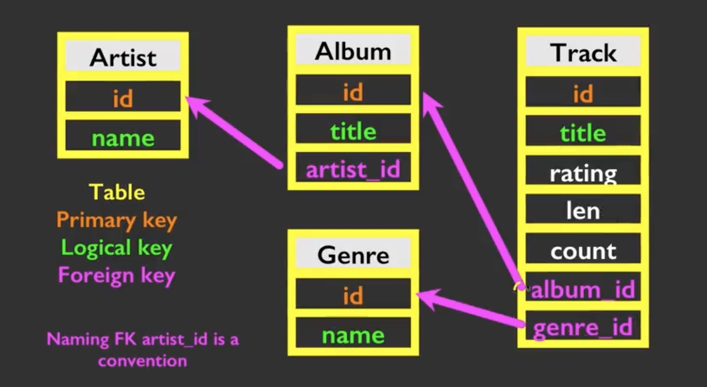

# Python for Everyone Study Notes

- Yixiao's study notes for Coursera Python for Everyone online course

- Last edit: 2025


## 1. Handling Files

### New line \n

- the newline character \n is also **a white space**

```python
\n

len("\n") = 1

len("a\na") = 3
```


### Counting lines in a file

- <u>for</u> loop reads the file through **a sequence** (an ordered set) (each line)

```python
file = open('mbox.txt')
count = 0
for line in file:
	count += 1
print("No of lines is", count)
```


### Reading the file as a string

- read() reads the file as one string

```python
>>> file = open('mbox.txt')
>>> inp = file.read()
>>> print(len(inp))
94923
>>> print(inp[:4])
abc
```


### Search a specific line

- Using **startwith()**

```python
file = open('mbox.txt')
for line in file:
  line = line.rstrip()	#remove the \n at the end of each line
  if line.startwith('From:'):
    print(line)
```

- Alternative:

```python
file = open('mbox.txt')
for line in file:
  line = line.rstrip()
  if line.startwith('From:'):
    continue #return to top of the loop
  print(line)
```

- Using **in()**

```python
file = open('mbox.txt')
for line in file:
  line = line.rstrip()
  if not '@gatech.edu' in line:
    continue
  print(line)
```


## 2. List []

- A **collection variable** (unlike string and int, which are normal variables)
- A list is a **ordered, mutable sequence**


### Looping through a list

- Method 1: simplest way

```python
for friend in friends: #["Jack", "Mike", "Sissy"]
	print("hi,", friend)
```

- Method 2: **collecting the index** too

```python
for i in range(len(friends)): #[0, 1, 2]
  friend = friends[i]
  print("hi,", friend)
```


### .sort()

- sorts the list **ascendingly** by default. (a on top, z on bottom)

```python
#correct
mylist.sort()
print(mylist)

#correct
newlist = sorted(mylist)
```

```python
mylist = []

fname = input("Enter file name: ")
try: 
    fh = open(fname)
except:
    print("File not found", fname)
    quit()

for line in fh:
    line = line.rstrip()
    lst = line.split()
    for word in lst:
        if not word in mylist:
            mylist.append(word)

mylist.sort()
print(mylist)
```


### .split()

- breaks a string into a list of strings. (one sentence to a list of words)

- **the delimiter character**: by defaults, split by white spaces " "

  - specify the delimiter as ";" 

    `split(";")`

```python
>>> sentence = "my name is Jack."
>>> print(sentence.split())
["my", "name", "is", "Jack."]
```

- Double split

```python
line = "from yixiao.zhang@gatech.edu Sat Jan 25"
words = line.split()
email = words[1]
pieces = email.split["@"]
print(pieces[1]) # returns "gatech.edu"
```

Assignment:

```python
count = 0

fh = open("mbox-short.txt")

for line in fh:
    line = line.rstrip()
    lst = line.split()
    if len(lst) > 1 and lst[0] == "From":
        count += 1
        print(lst[1])

print("There were", count, "lines in the file with From as the first word")
```


## 3. Dictionaries {}

- A linear collection of **key-value pairs**
- `newdict = {}` works the same as `newdict = dict()`
- Unlike lists using indices, **dictionaries use keys to look up values**
- **ordered**: ordered in the order that the entries were inserted

- Use "in" to check if a key is in the dictionary

  ```python
  >>> "jack" in mydict
  False
  ```

- Use .get() method

  .get(**target_key_name**, **default_value**)

  ```python
  # before
  if name in name_list:
    x = name_list[name]
  else:
    x = 0
    
  # after
  x = counts.get(name,0) # 0 is the default value if key doesn't exist
  ```

- Building a **histogram**: Counting strings' frequencies in a **list** with .get()

  - if one key exists in the dictionary, add one. If not, make it zero and add one

  ```python
  counts = dict() # the counter is a dictionary
  names = ["a", "a", "a", "b", "b", "b", "c"] # loop through a list
  for name in names:
  	counts[name] = counts.get(name, 0) + 1 # assign a 0 to new keys, then add 1
  print(counts)
  
  # returns {"a": 3, "b": 2, "c": 1}
  ```

- Retrieving lists of **keys, values, and items** (both) from a dictionary

  ```python
  # retrieve a list of keys
  print(list(dic.keys())) or print(list(dic))
  
  # retrieve a list of values
  print(list(dic.values()))
  
  # retrieve a list of items
  print(list(dic.items())) # this returns a list of **tuples**
  ```

- Use a **for loop** to go through a list of key-value pairs (tuples)

  ```python
  dic = {"jack": 2, "mike": 5, "kessie": 4}
  for aaa,bbb in dic.items():
    print(aaa, bbb)
  
  # jack 2
  # mike 5
  # jessie 4
  ```

- Counting and comparison

  ```python
  name = input("Enter file name:")
  handle = open(name) # put the file in the handle
  
  counter = dict() # empty dictionary
  for line in handle:
  	words = line.split()
    for word in words:
      counter[words] = counter.get(word,0) + 1 # make the key:value pairs
  
  bigcounter = None
  bigword = None
  for word,count in counter.items():
    if bigcount is None or count > bigcount: # find the biggest value 
      bigword = word
      bigcount = counter
  
  print(bigword, bigcount)
  ```

- Assignment

  ```python
  handle = open("mbox-short.txt")
  
  counts = {}
  for line in handle:
      line = line.rstrip()
      words = line.split()
      if len(line) >= 2 and words[0] == "From": # locate the word before the email address
          counts[words[1]] = counts.get(words[1],0) + 1 # count the frequency of each email address
  
  bigname = None
  bigcount = None
  for name,count in list(counts.items()): # find who sent the most emails
      if bigname is None or bigcount < count:
          bigname = name
          bigcount = count
  
  print(bigname, bigcount)
  ```

  

## 4. Tuples

- Tuples are immutatable Indexed sequences
- can't be sorted, appended, or reversed
- **Best for temporary storage, no need to edit, soon discard**: comsume less memory than lists, more efficient

### Tuple unpacking

```python
>>> (x, y) = (4, "fred") # we can put a tuple on the left side of an assignment statement
>>> print(y)
fred

>>> x,y = 4,"fred"	# also works w/o parenthesis
```


### Comparing tuples

- Compare the first element first

```python
>>> (0,1,2) < (1,5,8)
True
```

- If equal, rolling further until differ

```python
>>> (0,5,8) > (0,5,9)
False

>>> ("jones", "sally") < ("jones", "sam")
True		# "l" in sally is smaller than "m" in sam
```


### Sort a list of tuples

- Sort by the keys (the first item in the tuple)

```python
dic = {"b":1, "c":5, "a":10}

mylist = sorted(dic.items())	# create a sorted list

for k,v in sorted(dic.items()):
  print(k,v)	# directly print the tuples
```

- Sort by the values (2nd or more)

```python
dic = {"b":1, "c":5, "a":10}
mylist = []	# create a temporary empty list

for k,v in dic.items():
  mylist.append((v,k)) # swap the position of the keys & values

mylist = sorted(mylist)
print(mylist)
>>>[(1,"b"), (5,"c"), (10,"a")]

# mylist = sorted(mylist, reverse=True)	# sort reversely
```

- Slice a list

```python
for key,val in mylist[:10]:
  print(key,val)
```


### List comprehension

```python
# before
counts = {"b":1, "c":5, "a":10}

mylist = []
for key,val in counts.items():
  mylist.append((val,key))	# swap val and key

mylist = sorted(mylist, reverse=True)	# sort val in descending order

for val,key in mylist[:10]:	# keep only the top 10 
  print(key,val)
  
# after
counts = {"b":1, "c":5, "a":10}
print(sorted([(v,k) for k,v in counts.items()], reverse=True))
```

- Assignment

```python
handle = open("mbox-short.txt")

counts = {}
for line in handle:
    line = line.rstrip()
    words = line.split()
    if len(line) >= 2 and words[0] == "From":
        t = words[5].split(":")
        counts[t[0]] = counts.get(t[0],0) + 1

for k,v in sorted(counts.items()):
    print(k,v)
```


## 5. Regular Expressions

- Not native in Python, so need to `import re` first. 

| **^**        | Matches the beginning of a line                     |
| ------------ | --------------------------------------------------- |
| **$**        | Matches the end of the line                         |
| **.**        | Matches any character                               |
| **\s**       | Wildcard, matches whitespace                        |
| **\S**       | Matches any non-whitespace character                |
| *****        | Repeats a character zero or more times              |
| ***?**       | Repeats a character zero or more times (non-greedy) |
| **+**        | Repeats a character one or more times               |
| **+?**       | Repeats a character one or more times (non-greedy)  |
| **[aeiou]**  | Matches a single character in the listed set        |
| **[^XYZ]**   | Matches a single character *not* in the listed set  |
| **[a-z0-9]** | The set of characters can include a range           |
| **(**        | Indicates where string extraction is to start       |
| **)**        | Indicates where string extraction is to end         |


### re.search()

- Returns a True/False

```python
# using the string lib
if line.startswith("From:"):
  print(line)

# using re
if re.search("^From:",line): # ^ means start of the line
  print(line)
```

- `^` **anchor, means start with**
- `.` **wildcard character**
- `*` **for zero or more times**
- Example: `^X.*:` means any text that
  1. Find a sequence of characters that 
  2. starts at the beginning of a line/string, begins with an 'X'
  3. followed by any number of any characters
  4. and finally ends with a colon.

```python
X-Sieve:
X_567898767j:
X/sfasfasf:
```

- Example 2: `X-\S+:`
  1. Find a sequence of characters that 
  2. starts with 'X-'
  3. followed by at least one character that is not whitespace
  4. and finally ends with a colon.


### re.findall()

- Extracting the matching items

```python
import re
x = "I have 3 bags, each bag has 10 balls. "
print(re.findall("[0-9]+", x)) # number 0~9, one or more digits

>>> ["3","10"]
```

- Extracting range `()`

  ```python
  text = "From yixiao@gatech.edu Sat Jan 5 2025"
  y = re.findall("From (\S+@\S+)", text)
  print(y)
  >>> ["yixiao@gatech.edu"]
  ```


### Greedy Matching

- the repeat character like * and + push outward in both directions to match the largest possible string

​	if `x = "From: Jason told me: hello!"`  and `y = re.findall("^F.+:", x)`, 

​	y will get `"From: Jason told me:"` rather than `"From:"`

- Solution: ?

   `y = re.findall("^F.+?:", x)`


### Capturing Group ( )

- Double split

- Extracting the email domain `gatech.edu` from `yixiao@gatech.edu` 

  using `re.findall("@([^ ]*)")`.

  - `[^ ]` means any non-whitespace character.
  - `*` is a quantifier, means zero more more.


### List Comprehension

```python
import re
handle = open("regex_sum_2338600.txt")
counter = 0

for line in handle:
    line = line.rstrip()
    nums = re.findall("[0-9]+",line)
    for num in nums:
        counter += int(num)

print("The sum is", counter)
```

```python
import re

print( sum( [ int(num) for num in re.findall('[0-9]+', open("regex_sum_2338600.txt").read()) ] ) )
```


## 6. Internet Architecture


### Build TCP Sockets

- Transport Control Protocol: built on top of IP (Internet Protocol), handles flow control
- **Sockets**: a TCP connection
- **Port Numbers**: allows multiple networked apps to co-exist on the same server

```python
import socket
mysock = socket.socket(socket.AF_INET, socket.SOCK_STREAM)
mysock.connect(("data.pr4e.org", 80)) # host URL & port number
```

- Most common HTTP socket: 80
- Most common HTTPS socket: 443


### HTTP

- Hypertext Transfer Protocol: the dominant application layer protocol on the Internet
- **The set of rules to allow browsers to retrieve web documents from servers over the Internet**

```python
import socket
mysock = socket.socket(socket.AF_INET, socket.SOCK_STREAM)
mysock.connect(("data.pr4e.org", 80))
cmd = "GET http://data.pr4e.org/romeo.txt HTTP/1.0\r\n\r\n".encode() # HTTP GET + encode (UTF-8 -> bytes)
mysock.send(cmd) # send the request

while True: # receive the content
  data = mysock.recv(512)
  if (len(data) < 1): # if failed
    break
  print(data.decode()) # print the received content
mysock.close()
```

```cmd
# what the HTTP request above received
>>> python3 http-request.py 
HTTP/1.1 200 OK
Date: Sun, 07 Dec 2025 09:55:40 GMT
Server: Apache/2.4.52 (Ubuntu)
Last-Modified: Sat, 13 May 2017 11:22:22 GMT
ETag: "a7-54f6609245537"
Accept-Ranges: bytes
Content-Length: 167
Cache-Control: max-age=0, no-cache, no-store, must-revalidate
Pragma: no-cache
Expires: Wed, 11 Jan 1984 05:00:00 GMT
Connection: close
Content-Type: text/plain

But soft what light through yonder window breaks
It is the east and Juliet is the sun
Arise fair sun and kill the envious moon
Who is already s
ick and pale with grief
```


### Unicode characters

- ord(): returns the numetic ASCII value of a character

- **UTF-8**: 

  - best practice for encoding data 
  - 1~4 bytes, upward compatible with ASCII

- in Python 3, all strings are Unicode

- Python strings to bytes

  ```python
  while True:
    data = mysock.recv(512) # received data are in bytes
    if (len(data) < 1):
      break
    mystring = data.decode() # asking python to decode, bytes -> UTF-8
    print(mystring)
  ```


### Urllib

- Python has pre-built functions for the HTTP sockets and web files
- Example: string retrieval + word frequency counter

```python
import urllib.request, urllib.parse, urllib.error

file_handle = urllib.request.urlopen("https://yixiaosz.github.io") # request the document
for line in file_handle:
  print(line.decode().rstrip()) # get the strings
```


### Beautiful Soup

- for web scraping/spidering
- [Beautiful Soup](https://beautiful-soup-4.readthedocs.io/en/latest/): a free software library for web parsing
- Example: **anchor tag retriever**

```python
import urllib.request, urllib.parse, urllib.error
from bs4 import BeautifulSoup

url = "https://yixiaosz.github.io"
html = urllib.request.urlopen(url).read()
soup = BeautifulSoup(html, "html.parser")

tags = soup("a") # retrieve all anchor tags
for tag in tags:
    print(tag.get("href", None))
```

- Assignment (what I wrote on myself)

```py
import urllib.request, urllib.parse, urllib.error, re
from bs4 import BeautifulSoup
position = int(input("Enter position:"))
count = int(input("Enter count:"))
c = 0

url = "http://py4e-data.dr-chuck.net/known_by_Prabodhan.html"
html = urllib.request.urlopen(url).read()
soup = BeautifulSoup(html, "html.parser")

list_items = soup("a")
target_a = list_items[position - 1]
while True:
    url = target_a.get("href",None)
    print("Retrieving:", url)
    html = urllib.request.urlopen(url).read()
    soup = BeautifulSoup(html, "html.parser")
    c += 1
    if c == count:
        break
    list_items = soup("a")
    target_a = list_items[position - 1]

print(target_a.text)
```

- Simplified solution (by Gemini)

```python
import urllib.request
from bs4 import BeautifulSoup

start_url = "http://py4e-data.dr-chuck.net/known_by_Prabodhan.html"
position = int(input("Enter position (1-based index): "))
count = int(input("Enter count (number of links to follow): "))

current_url = start_url

# --- Link Following Loop ---
for i in range(count):
    print(f"--- Iteration {i+1} / {count} ---")
    
    try:
        # Fetch the HTML
        print(f"Retrieving: {current_url}")
        html = urllib.request.urlopen(current_url).read()
        soup = BeautifulSoup(html, "html.parser")

        list_items = soup('a')
        
        # Check if the desired position is valid
        if 0 < position <= len(list_items):
            # Select the target link (position is 1-based, list is 0-based)
            target_tag = list_items[position - 1]
            
            # Update the URL for the next iteration
            current_url = target_tag.get('href')
            
            # The last name found is the answer.
            final_name = target_tag.text

        else:
            print(f"Error: Link position {position} not found on the page.")
            break

    except Exception as e:
        print(f"An error occurred during retrieval or parsing: {e}")
        break

# --- Final Result ---
print("\nFinal link followed (target name):", final_name)
```


### XML 

- Extensible Markup Language
- the wire format for sending data on web (older than Json)
- **Python dictionary** --*serialize*--> **XML** --*deserialize*--> **Java hashmap**

- XML Schema contract: a file that define the structure and constraints of its corresponding XML file. 
- Example (generated by Gemini): 
  - Elements, Attributes, text

```xml
<?xml version="1.0" encoding="UTF-8"?>
<bookstore>
    <book category="fiction">
        <title lang="en">The Hitchhiker's Guide to the Galaxy</title>
        <author>Douglas Adams</author>
        <year>1979</year>
        <price>12.99</price>
    </book>
</bookstore>
```

- Time format: 
  - better use ISO8601 Date
  - YYYY-MM-DD**T**HH:MM:SS**Z** (T: time of day, Z: timezone, UTC by default)

- **Parsing XML ** [documentation](https://docs.python.org/3/library/xml.etree.elementtree.html#xpath-support)

```python
import xml.etree.ElementTree as ET

data = '''<bookstore>
    <book category="fiction">
        <title lang="en">The Hitchhiker's Guide to the Galaxy</title>
        <author>Douglas Adams</author>
        <year>1979</year>
        <price>12.99</price>
    </book>
</bookstore>'''

tree = ET.fromstring(data)
my_book = tree.find('book')

print('Title:', my_book.find('title').text)
print('Author:', my_book.find('author').text)
```

- if multiple items under a tag (complex elements)

```python
my_books = tree.findall('book')
for my_book in my_books:
  print('Title:', my_book.find('title').text)
	print('Author:', my_book.find('author').text)
```

- Assigment

```python
import urllib.request, xml.etree.ElementTree as ET

handle = urllib.request.urlopen("http://py4e-data.dr-chuck.net/comments_2338604.xml").read()
tree = ET.fromstring(handle)

print(sum([int(num.text) for num in tree.findall(".//count")]))
```


### JSON

- native to Javascript syntax
- JSON represents data as **nested lists and dictionaries **(closer than XML to Python's native lists and dics)

```python
import json 
data = '''{ 
	"name" : "Jack",
	"phone" : {
		"type" : "intl", 
		"number" : "+1 744 303 3321"
	}, 
	"email" : {
		"hide" : "yes"
	}
}'''

info = json.loads(data)
print('Name:', info["name"])
print('Hide:', info["email"]["hide"])
```


### SOA and APIs

- SOA: Service Oriented Architectures
  - a service layer that allows an application to be broken into parts and distributed across a network
- API: Application Programming Interfaces
  - a contract for interaction
- How to reduce the frequency of API request? Use **edge caching**: (e.g. in Cloudflare)
  - store all previously-requested data in a separate server. 
  - if a new request asks the same thing, the server simply pulls the old data
- SOAP and REST: 2 styles of webs services (the infrastructures for APIs), REST is more preferred nowadays
- XML and JSON are serialization formats
- OAuth (Open Authoration): security credentials, granting limited access to the API's resources to certain clients

```python
import urllib.request, json, ssl, urllib.parse
serviceurl = 'https://py4e-data.dr-chuck.net/opengeo?'

ctx = ssl.create_default_context()
ctx.check_hostname = False
ctx.verify_mode = ssl.CERT_NONE

address = "Boston University"
parms = dict()
parms['q'] = address

url = serviceurl + urllib.parse.urlencode(parms)

print('Retrieving', url)
uh = urllib.request.urlopen(url, context=ctx)
data = uh.read().decode()
print('Retrieved', len(data), 'characters', data[:20].replace('\n', ' '))

try:
    js = json.loads(data)
except:
    js = None

if not js or 'features' not in js:
    print('==== Download error ===')
    print(data)

if len(js['features']) == 0:
    print('==== Object not found ====')
    print(data)

# print(json.dumps(js, indent=4))

print(js["features"][0]["properties"]["plus_code"])

    # lat = js['features'][0]['properties']['lat']
    # lon = js['features'][0]['properties']['lon']
    # print('lat', lat, 'lon', lon)
    # location = js['features'][0]['properties']['formatted']
    # print(location)

```


## 7. Databases

### Object-orientation

- a program is made up of many cooperating **objects (self-contained code and data)**
- each object can be considered as a "little island" within the program
- objects make use of each other's capabilities
- string objects, integer objects, dictionary objects...

1. Class: a template
2. object or instance: a particular instance of a class
3. method or message: a defined capability of a class, a verb
4. field of attribute: a bit of data in a class


### dir()

- lists a thing's capabilities
- the ones like "\__init__" are used by Python itself
- the ones like "append" are the object that it can perform

```python
>>> x = "hello"
>>> dir(x)
['__add__', '__class__', '__contains__', '__delattr__', '__dir__', '__doc__', '__eq__', '__format__', '__ge__', '__getattribute__', '__getitem__', '__getnewargs__', '__getstate__', '__gt__', '__hash__', '__init__', '__init_subclass__', '__iter__', '__le__', '__len__', '__lt__', '__mod__', '__mul__', '__ne__', '__new__', '__reduce__', '__reduce_ex__', '__repr__', '__rmod__', '__rmul__', '__setattr__', '__sizeof__', '__str__', '__subclasshook__', 'capitalize', 'casefold', 'center', 'count', 'encode', 'endswith', 'expandtabs', 'find', 'format', 'format_map', 'index', 'isalnum', 'isalpha', 'isascii', 'isdecimal', 'isdigit', 'isidentifier', 'islower', 'isnumeric', 'isprintable', 'isspace', 'istitle', 'isupper', 'join', 'ljust', 'lower', 'lstrip', 'maketrans', 'partition', 'removeprefix', 'removesuffix', 'replace', 'rfind', 'rindex', 'rjust', 'rpartition', 'rsplit', 'rstrip', 'split', 'splitlines', 'startswith', 'strip', 'swapcase', 'title', 'translate', 'upper', 'zfill']
```


### Define a class

- A template for creating new objects

```python
class PartyAnimal:
  
  def __init__(self): # method 1: (reserved name) constructive method
    self.x = 0 # define the value of the attribute "x"
  
  def party(self): # method 2
    self.x = self.x + 1
    print("So far", self.x)
    
an = PartyAnimal() # initialize the class PartyAnimal

an.party() # call the .party() method
```


### Object Lifecycle

- objects are created, used, and discarded
- Although, destructors are rarely used in Object Oriented Programming

```python
class PartyAnimal:
  
  def __init__(self):
    self.x = 0
    print("I'm constructed")
  
  def party(self): 
    self.x = self.x + 1
    print("So far", self.x)
  
  def __del__(self): # the destructive method (automatically called)
    print("I'm destructed", self.x)
```

```python
an = PartyAnimal() # object created 
an.party() # object's method used
an = 42 # object is replaced by an integer, and is destructed
```


### inherit from a parent classes

```python
class PartyAnimal:
  
  def __init__(self, nam):
    self.x = 0
    self.name = nam
    print(self.name,"constructed")
  
  def party(self): 
    self.x = self.x + 1
    print(self.name,"party count:", self.x)

class FootballFan(PartyAnimal): # calls in the parent class
  
  def __init__(self, nam):
    super().__init__(nam) # calls the parent class PartyAnimal and fully inherit its capability
    self.points = 0 # add a new attribute "points" in the constructive method
  
  def touchdown(self): # add a new method
    self.party()
    print(self.name,"points",self.points)
```

```python
>>> s = partyAnimal("Sally")
Sally constructed
>>> s.party()
Sally party count: 1
>>> j = FootballFan("Jim")
Jim constructed # j has 3 attributes at creation, x, name, and points
```


### SQL

- Structured Query Language

- **Relational Database**: relations that stored as rows and columns
  - rows ➡️: tuples
  - columns ⬇️: attributes
- Basic functions (**CRUD**)
  - create a table
  - retreive data
  - insert data
  - delete data
- Database administrator: DBA
- **Database model**/schema: the contract, the structure or format of the database, the app of a data model when used in conjunction with a database management system
- Common Database systems: Oracle, MySql, SqlServer, SQLite
- SQLite is so lightweight that it can be built into other softwares
- While `execute()` runs only one SQL statement, `executescript()` can run multiple at a time

```sqlite
CREATE TABLE Users(
	name VARCHAR(128),
	email VARCHAR(128)
)
INSERT INTO Users(name,email) VALUES('Jack','jack@gatech.edu')
DELETE FROM Users WHERE email='jack@gatech.edu'
UPDATE Users SET name='Charles' WHERE email='charles@gatech.edu'

SELECT * FROM Users --* means all column lists
SELECT * FROM Users WHERE email='charles@gatech.edu'--set a constraint
SELECT * FROM Users ORDER BY email --sorted ascendingly by email
```

- Create and edit an SQLite table in python

```python
import sqlite3

conn = sqlite3.connect('orgdb.sqlite')
cur = conn.cursor()

cur.execute('DROP TABLE IF EXISTS Counts')

cur.execute('''
CREATE TABLE Counts (org TEXT, count INTEGER)''')

fname = 'mbox.txt'
fh = open(fname)
# print(fh)

for line in fh:
#   print(line)
  if not line.startswith('From: '): continue
  pieces = line.split()
  email = pieces[1]
#   print(email)
  org = email.split('@')[1]
#   print(org)
  cur.execute('SELECT count FROM Counts WHERE org = ?', (org,))
  row = cur.fetchone()
  if row is None: 
    cur.execute('''INSERT INTO Counts (org, count) VALUES (?, 1)''', (org,))
  else:
    cur.execute('UPDATE Counts SET count = count +1 WHERE org = ?',
               (org,))
  conn.commit()
  
sqlstr = 'SELECT org, count FROM Counts ORDER BY count DESC LIMIT 10'

for row in cur.execute(sqlstr):
  print(str(row[0]), row[1])
```


### Database Design

- A picture/contract/schema of how data is being stored in the application
- Rule
  - don't put the same string data in twice - use a relationship
  - one realword thing matches one database mirror
- Consider:
  - Is the column an object or just an attribute of another object?
  - Once objects are defined, we need to define the relationships between objects
- Primary key (a unique id for a row), 
- Logical key (a unique name/title for external-initiated search)
- Foreign key(locates one of the columns we added to a row)



- When creating a table, always **start creation from the ends of the arrows** (artist --> arbum -- Genre --> Track) to avoid missing dependencies


### JOIN operation

- links across several tables as part of a select operation
- ON clause a must

```sqlite
select Album.title, Artist.name from Album join Artist on Album.artist_id = Artist.id
--         what we want              the two tables        how to tables are linked (also the requirement)
```


### Many to Many Relationships

- A connection/junction table with two foreign keys is required


```sqlite
-- create two regular tables
CREATE TABLE User (
	id		INTEGER NOT NULL PRIMARY KEY AUTOINCREMENT UNIQUE,
  name	TEXT,
  email	TEXT
)

CREATE TABLE Course (
	id 		INTEGER NOT NULL PRIMARY KEY AUTOINCREMENT UNIQUE,
  title TEXT
)

-- this is a many-to-many junction table
CREATE TABLE Member (
	user_id 	INTEGER, 
  course_id	INTEGER,
  role			INTEGER,
  PRIMARY KEY (user_id, course_id)
)

-- insert sample data into the two regular tables
INSERT INTO User (name, email) VALUES ('Jane','jane@college.edu')
INSERT INTO User (name, email) VALUES ('Jack','jack@college.edu')
INSERT INTO User (name, email) VALUES ('Mark','mark@college.edu')

INSERT INTO Course (title) VALUES ('Python')
INSERT INTO Course (title) VALUES ('PHP')
INSERT INTO Course (title) VALUES ('SQL')

-- insert sample data into the junction table
INSERT INTO Member (user_id, course_id, role) VALUES (1,1,1)
INSERT INTO Member (user_id, course_id, role) VALUES (1,1,0)
INSERT INTO Member (user_id, course_id, role) VALUES (3,1,0)

INSERT INTO Member (user_id, course_id, role) VALUES (1,2,0)
INSERT INTO Member (user_id, course_id, role) VALUES (2,2,1)

INSERT INTO Member (user_id, course_id, role) VALUES (2,3,1)
INSERT INTO Member (user_id, course_id, role) VALUES (3,3,0)

-- join the relationships
SELECT User.name, member.role, Course.title 
FROM User JOIN Member JOIN Course
ON Member.user_id = User.id AND Member.course_id = Course.id
ORDER BY Course.title, Member.Role DESC, User.name
```


### Geocoding

- Multi-Step Data Analysis
  - ensures a **restartable** process
  - Most data mining technologies uses this process
- Geo-data visualization
  - [OpenGeo](http://www.py4e.com/code3/opengeo.zip)
  - 
