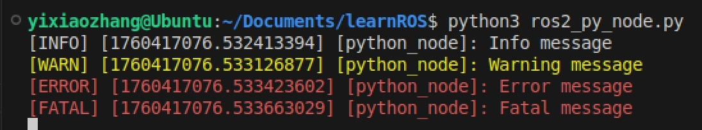
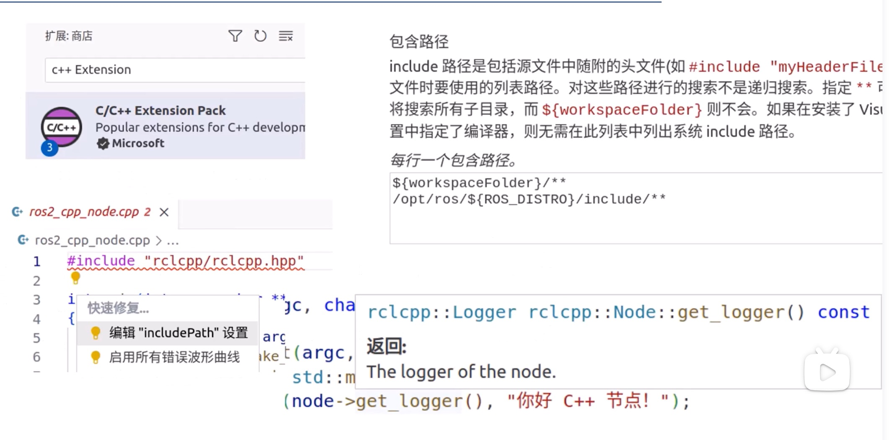

# ROS2 Study Notes

Created on 10/15/2025


## Foundamentals


### chmod a+x something.py

- The *chmod* command in Linux is used to change the **permissions** of a file or directory. 
- The *a+x* option specifically adds execute permissions for **all users** (owner, group, and others).


### \#!/usr/bin/python3

- A **shebang** in Python
- It's a special line at the **beginning** of a script that tells the OS which interpreter to use to execute the script. With this line, the script can run without a proper file extension. e.g. hello_world~~.py~~

### Compiler: g++

- this command is a **C++ compiler** for processing the source code to generate an **executable** file. 

- ```shell
  $ g++ file_name.cpp
  ```

  default compiling this generates an /a.out executable file by default. 

- ```shell
  $ g++ -o main.exe file_name.cpp
  ```

  this generates an executable file with name 'main.exe'


### Compiler: CMake

- a build system generator for C++ and more. More efficient than g++

- Basic setup

  1. Create a CMakeLists.txt

     ```cmake
     # Specify the minimum version of CMake required
     cmake_minimum_required(VERSION 3.10)
     # Set the project name
     project(MyProject)
     # Add an executable target
     add_executable(MyExecutable main.cpp)
     ```

  2. Create a build directory. **Best practice**: create a separate directory for the generated build files. 

     ```shell
     # Create a separate directory for the build file
     $ mkdir build
     # Enter the newly created directory
     $ cd build
     # create the build files + specify the build file is in the upper directory
     $ cmake -S ../
     # generate the executable file MyExecutable
     $ make
     ```

     ```shell
     project/
     ├── CMakeLists.txt
     ├── src/
     └── build/  # Generated files go here
         ├── CMakeCache.txt
         ├── Makefile
         └── ...
     ```

     

### Environmental Variables

Checking the env **AMENT_PREFIX_PATH** is a great starting point for solving error **'package [xxx] not found'**. If the AMENT/lib path simply don't have the package or executables you're looking for, you need to assign a new value for the env. 

```shell
# print environmental variables
$ printenv

# print environmental variables that include the pattern 'AMEND'
$ printenv | grep AMENT
```

Edit an environmental variable **temporarily**: 

```shell
# Change the value within the current terminal
$ export AMENT_PREFIX_PATH=/opt/ros/
```


### .bashrc script

- This file is a script that runs whenever a user logs into a terminal session in Linux. 
- Hidden by default (.)

```shell
# show all files, including the hidden ones
$ ls -a

# view the .bashrc file
$ cat ~/.bashrc

# in the .bashrc, one line sets the AMENT_PREFIX_PATH env
source /opt/ros/kilted/setup.bash

```

- After change the .bashrc script, you must open a **new** terminal window to run it. 


### What's <u>$ ros2 run</u>?

By checking env in the terminal:

```shell
$ printenv | grep AMENT
AMENT_PREFIX_PATH = /opt/ros/kilted
```

We knew that ros2 run simply checks the value of AMENT_PREFIX_PATH, and navigate to the ROS2 file path of /opt/ros/kilted. 

Then, it finds the executable file with the file path lib/package_name/executable_file.

```shell
$ ros2 run turtlesim turtlesim_node

# Equals to
$ cd /opt/ros/kilted/lib/turtlesim/
$ ./turtlesim_node

# Equals to
$ $AMENT_PREFIX_PATH/lib/turtlesim/turtlesim_node
```

Double-check: 

```shell
$ echo $AMENT_PREFIX_PATH/lib/turtlesim/turtlesim_node
/opt/ros/kilted/lib/turtlesim/turtlesim_node
```


### My 1st Node (Python)

Sample node: 

```python
import rclpy
from rclpy.node import Node

def main():
    # initialize the communication and 
    rclpy.init()
    # assign a node name
    node = Node('python_node')
    # ROS2 logging methods
    node.get_logger().debug('Debug message')
    node.get_logger().info('Info message') 
    node.get_logger().warning('Warning message')
    node.get_logger().error('Error message')
    node.get_logger().fatal('Fatal message')
    rclpy.spin(node)
    # quit after run
    rclpy.shutdown()

# execute the code when the file runs as a script, see below to learn more
if __name__=='__main__':
    main()
```

```shell
$ python3 my_ros_node.py
```




**What's \_\_name\_\_=='\_\_main\_\_' for?**

```python
if __name__=='__main__':
    main()
```

- Only run the following code if this file is being executed directly, NOT when it's imported as a module.

- Without this guard, the main() function would run every time the file is imported, which is usually not desired behavior.


Search for all **running ros nodes** 

```shell
# console returns the names of all running nodes
/python_node
```

[Console output formatting](https://docs.ros.org/en/kilted/Tutorials/Demos/Logging-and-logger-configuration.html) - env: **RCUTILS_CONSOLE_OUTPUT_FORMAT**

```shell
# default logging format
$ python3 my_ros_node.py
[INFO] [1760417076.532413394] [python_node]: Info message

# assign a new format for ros2 logging console output
$ export RCUTILS_CONSOLE_OUTPUT_FORMAT=[{function_name}:{line_number}]:{message}
$ python3 my_ros_node.py
[main:11]:Info message
```


### My 1st Node (C++)

- Add ROS2 include path 



```shell
${workspaceFolder}/**
/opt/ros/${ROS_DISTRO}/include/**
```

- **Sample node**

```cpp
#include <rclcpp/rclcpp.hpp>

// argc = Argument count (number of command-line arguments)
// arv = Argument vector (array of strings containing the arguments)
int main(int argc,char** argv)
{
    rclcpp::init(argc,argv);
    
    // **smart pointer**: creates a std::shared_ptr that manages a dynamically allocated rclcpp::Node object
    auto node = std::make_shared<rclcpp::Node>("cpp_node");
    
    // log something when executed
    RCLCPP_INFO(node->get_logger(),"Hi, I\'m a CPP node.");
    rclcpp::spin(node);
    rclcpp::shutdown();
    
    return 0;
}
```

- **Sample CMakeList.txt** (without the required dirs and libs, the #include will return errors)

```cmake
cmake_minimum_required(VERSION 3.8)
project(ros2_cpp_node)
add_executable(ros2_cpp_node ros2_cpp_node.cpp)

find_package(rclcpp REQUIRED) # find the libs and header file

# print the found header files and the dependencies of the head files found by find_package
message(STATUS ${rclcpp_INCLUDE_DIRS}) 
# print the libraries found by find_package
message(STATUS ${rclcpp_LIBRARIES}) 

# include the required directories
target_include_directories(ros2_cpp_node PUBLIC ${rclcpp_INCLUDE_DIRS})
# include the required libraries too
target_link_libraries(ros2_cpp_node ${rclcpp_LIBRARIES})
```


### ROS Create packages

- Sample: (build-type = python, license = Apache2.0, name=demo_python_pkg)

```shell
$ ros2 pkg create --build-type ament_python --license Apache-2.0 demo_python_pkg
```

- Created package structure

```shell
demo_python_pkg/
├── package.xml # declare the new node's dependencies here
├── LICENSE
├── setup.py # declare the new node here
├── setup.cfg
├── resource/
│   └── demo_python_pkg
├── test/
│   ├── test_copyright.py
│   ├── test_flake8.py
│   └── test_pep257.py
│   └── test_xmllint.py
└── demo_python_pkg/ # Add your new nods here
    └── __init__.py
    └── #python_node.py
```

- Declare a new node in setup.py

```python
...
entry_points={
    'console_scripts': [
        'python_node = demo_python_pkg.python_node:main', #declare like this
        'another_node = demo_python_pkg.another_node:main',
    ],
},
...
```

- Declare dependencies in package.xml 

```xml
<depend>rclpy</depend> 
```

- Your package will build and run correctly no matter where you put `<depend>rclpy</depend>`. However, correct ordering makes the package more legible and maintainable. 
- Best practice: 

```xml
...

  <!-- 1. Build tool dependencies -->
  <buildtool_depend>ament_python</buildtool_depend>
  <buildtool_depend>ament_cmake</buildtool_depend> <!-- if mixed package -->

  <!-- 2. Required dependencies (alphabetical) -->
  <depend>rclpy</depend>
  
  <!-- 3. Optional dependencies (alphabetical) -->
  <depend>geometry_msgs</depend>

  <!-- 4. Test dependencies (alphabetical) -->
  <test_depend>ament_copyright</test_depend>

...
```

