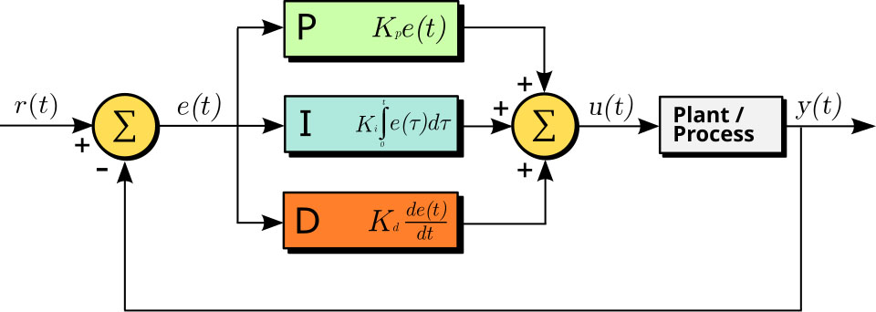
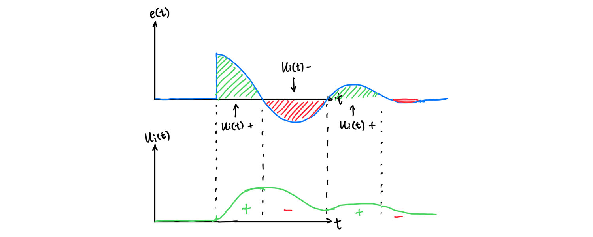
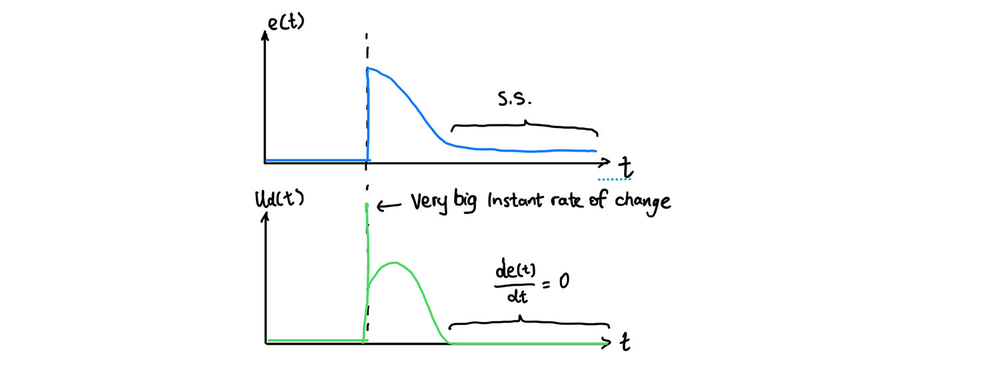
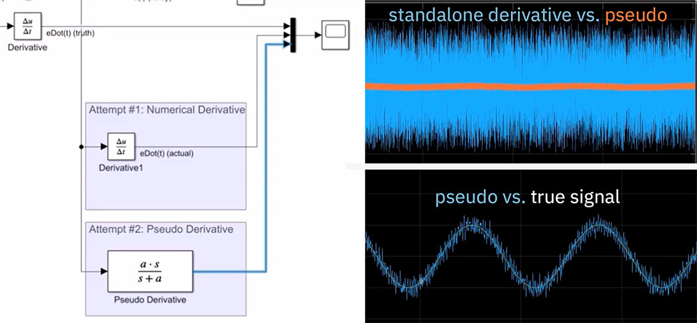
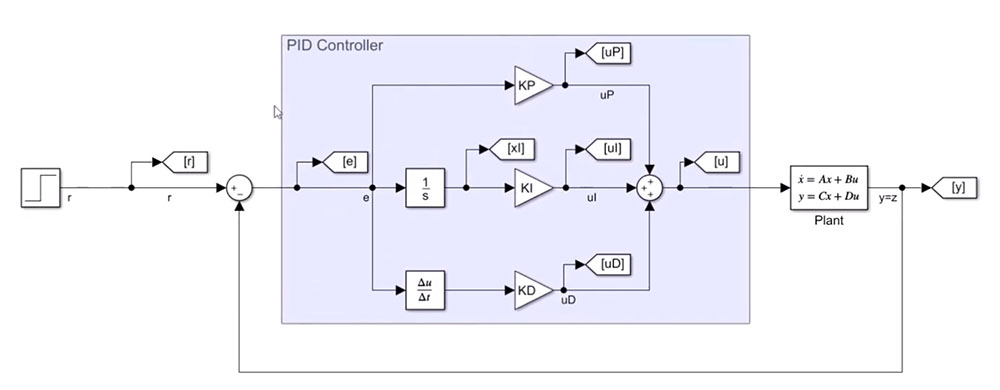
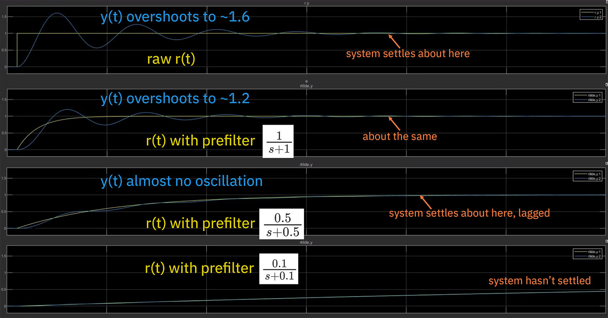
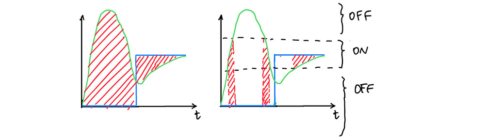

# PID Controller

Notes created on 12/25/2025 using Typora




> A block diagram of a PID controller in a **feedback loop**. (source: Wikipedia)

- Input reference signal $r(t)$ 
- Error signal $e(t) = r(t) - y(t)$ 
- Control signal $u(t)$ 
- Output signal $y(t)$ 
- Controller gain $K_p,K_i,K_d$ 

- Goal: $e(t) = 0$, $y(t)$ matches $r(t)$


## PID Control Law

$u(t) = K_p \cdot e(t) + K_i \cdot \frac{1}{s} \text{(Integrator)} \cdot e(t) + K_d \cdot s \text{(differentiator)} \cdot e(t)$ 

$$u(t) = \underbrace{K_p \cdot e(t)}_{u_p(t)} + \underbrace{K_i \cdot \int_{0}^{t} e(\tau)d\tau}_{u_i(t)} + \underbrace{K_d \cdot \frac{de(t)}{dt}}_{u_d(t)}$$


### 1. Proportional Control (P)


- The larger the error, the stronger the control signal $U_p(t)$
- Provides stability against small disturbances, but insufficient for dealing with a steady disturbance (leaves a steady-state error 稳态误差)
  - most systems leaves a non-zero s.s. error with only the P controller

- Think of the P Controller as a **rubber band** connecting a weight’s actual position and the target position. 

  - The stiffness of the rubber band is the Proportional Gain $K_p$. 

  - The rubber band oscillates up and down until it settles at a point where the rubber band is stretched *just enough* to counteract gravity. That stretch is the steady-state error. 

  - Ideally, the larger $K_p$, the smaller the steady-state error: $e_{ss} \approx \frac{1}{1 + K_p}$. 

  - However, high gain causes violent oscillation and the system will be unstable. 


### 2. Integral Control (I)



- The main controlling force
- **Eliminates the steady-state error**
  - If a non-zero s.s. error exists, the control signal $u_i(t)$ will increase towards infinity! 
- However, it overshoots! The error signal will **oscillate** above and below zero until it reaches the zero s.s. error. 


### 3. Derivative Control (D)



- The **damper of the system**, reducing oscillations. 
- The more dynamic the error signal $e(t)$ is, the larger its rate of change $\frac{de(t)}{dt}$ is, so the stronger the D control signal $K_d \cdot \frac{de(t)}{dt}$ is. 
- When the error reaches steady-state (flat), no matter zero or non-zero, the D control signal becomes zero too. 


## Practical Implementations

### 1. Amplified noise in pure derivatives

- ⚠️ With just **a standalone pure derivative** $[s]$ , **any noise will be amplified and it corrupts the output signal**. 
  - D controller output $u_d(t) = K_d \cdot s \cdot e(t) \text{(Laplace domain)} = K_d \cdot \frac{de(t)}{dt} \text{(pure derivative form)}$ 
  - ⛔️ Predictive (forward), **non-causal derivative**:  $\dot{e}(k) = \frac{e(k+1) - e(k)}{T}$, $T$ is the small time step. However, $e(k+1)$ is in the future, we don’t know. 
  - ✅ Approximate (backward), **causal derivative**: $\dot{\tilde{e}}(k) = \frac{e(k)-e(k-1)}{T}$. We use the known prior time fraction instead. 
- Real-life scenario: $\dot{\tilde{e}}(k) = \frac{e(k)-e(k-1) + n(k)}{T} = \frac{e(k)-e(k-1)}{T}+\frac{n(k)}{T}$, $n(k)$ is the amount of random noise in the time fraction.
  - **The smaller the time fraction $T$, the more amplified the noise $\frac{n(t)}{T}$ is.** 

- Best robust practice: adding built-in **low-pass filters** $\frac{a}{s+a}$. 

  - $a$ is the cutoff frequency, $s$ is the pure derivative. 
  - At low frequency (mostly the derivative we want): $s \approx 0$, so $\frac{a}{0 + a} = \frac{a}{a} = 1$. 
  - At high frequency (mostly the noise): $s \approx 1$, so $\frac{a}{\infty + a} \approx \frac{a}{\infty} \approx 0$. 

- $u_d(t) = K_d \cdot s \cdot e(t) \cdot \frac{a}{s+a} = K_d \cdot e(t) \cdot \frac{as}{s+a}$. 

  - $\frac{as}{s+a}$ is a **pseudo derivative**, turning the input signal $e(t)$ into an approximate derivative $\dot{\tilde{e}}$. 

    


#### Daisy-chaining low-pass filters

- Daisy chaining several low-pass filters: $u_d(t) = K_d \cdot e(t) \cdot \frac{as}{s+a} \cdot \frac{a}{s+a} \cdot \frac{a}{s+a}... = K_d \cdot e(t) \cdot \frac{as}{s+a} \cdot (\frac{a}{s+a})^n$ can further clean-up the noise. 

  - ⚠️ Adding low-pass filters introduce **phase lags**, especially when there’re multiple low-pass filters and the frequency is high (e.g. $\omega = 50$). 

    

- Using pseudo derivative $\frac{as}{s+a}$ also can avoid infinite $U_d(t)$ output when there’s a **step change** in the reference signal $r(t)$. 
  - Example: a user adjusts the oven temperature from 120ºC to 140ºC. ⚠️ Pure derivative $s = \infty$, but $\frac{as}{s+a}$ won’t. 


### 2. Integrator anti-wind-up

- Recalling from section [Integral Control](#2-integral-control-i), an integrator always **overshoots the system** $y(t)$ after reaching the set point $r(t)$ and drives the systems beyond $r(t)$. The system $y(t)$ will **oscillate** back and forth of $r(t)$ until it eventually matches $r(t)$. 
- The integrator is **an accumulator, the net sum of the entire history of the movement**. 
  - At the steady-state, the difference in positive error & negative error is exactly what’s needed to hold the system at the set point. 
  - In systems that have external load, ==$u_i(t)$ will stay at a non-zero steady-state to balance the external load.== ([See example](#integrator-non-zero-ss-example))
  -  when $e(t) = 0$: 
    - P controller’s $u_p(t) = 0$, 
    - Derivative controller’s $u_d(t) = 0$, 
    - **$u_i(t)$ is the only controlling factor remains**. 
  - External load examples: gravity, heat loss, air friction etc. 

- ⚠️ We need to **be aware of and control** an integrator’s winding up. If integrator amount goes very high, it would overshoot drastically! 
- ✅ **Anti-wind-up solutions**:
  	1. **Gradually increase the set point**: less oscillation but longer settlement time. ([See details](#solution-1-gradually-increase-the-set-point))
  	1. **Disable integrator until system nears set point**: system becomes non-linear, adding complexity. ([See details](#solution-2-disable-integrator-until-system-nears-set-point)) 
  	1. **Limit time period over which integral is calculated**: . ([See details](#solution-3-limit-time-period-over-which-integral-is-calculated))
  	1. ⭐️ **Limit the max/min state of the integrator**: Limits the amount of errors the integrator is allowed to accumulate. ([See details](#solution-4-limit-the-maxmin-state-of-the-integrator))


#### Integrator non-zero s.s. example

- Spring-mass damper model

-  Goal: to move the block from [0,0] to [1,0], aka to move it 1 meter to the right. 

- ```matlab
  clear
  clc
  close all
  
  m = 2; %block mass
  k = 0.1; %spring constant
  c = 0.05; %damping ratio
  
  A = [0 1;-k/m -c/m];
  B = [0;1/m];
  C = [1 0];
  D = [0];
  
  x0 = [0;0]; %block starting position velocity
  
  KP = 1.2;
  KI = 0.15;
  KD = 0.6;
  
  deltaTMax = 0.05;
  ```

- 

 

- ==As long as the integral gain $K_i$ is non-zero==, $u_i$ will eventually drive the system to the zero s.s. 


#### Solution 1: Gradually increase the set point

- Add a **prefilter** $P(s)$ that damps a step change in $r(t)$ into a gradual change. 
- The prefilter $P(s)$ must have:
  1. net DC gain = 1, so it outputs the same $r(t)$ that was specified.
  2. a bandwidth that **doesn’t handicap** the entire closed loop system. 
     - **The trade-off**: A super slow prefilter can almost eliminate the integrator’s oscillation, but the system would take a looong time to settle (which obviously handicaps the entire system). 
- Example prefilter: a low-pass filter with DC gain a=1, $\frac{1}{s+1}$. 





#### Solution 2: Disable integrator until system nears set point

- When there’re multiple conditions the automatic system needs to switch in between, disable the integrator during the transient period. 
  - When out of the ON range, the system acts as a PD controller. 
- However, this solution **turns the system into non-linear, hybrid switch system**. 



#### Solution 3: Limit time period over which integral is calculated

- Original $u_i(t) = K_i \cdot \int_{0}^{t} e(\tau)d\tau$ 
- Limited time period: $\tilde{u_i}(t) = K_i \cdot \int_{t-w}^{t} e(\tau)d\tau$ 
  - $w$ is a set amount of time. 
- This solution limits the amount of error the integrator can accumulate. 
- However, this solution weakens the integral control. 


#### Solution 4: Limit the max/min state of the integrator

- ⭐️ **The most effective solution**
- Drawback: System becomes **non-linear**. 
- In MatLab, Integrators can be configured with **upper and lower saturation limits**. 
- Note 1: $\frac{1}{s}$ with **internal** saturation limits $\neq$ $\frac{1}{s}$ + saturation limits
  - With internal limits, $u_i$ pauses accumulation when over the limits
  - With external limits, $u_i$ never pauses. 
- Note 2: $K_i \cdot \frac{1}{s}\text{(limited)} \neq \frac{1}{s}\text{(limited)}\cdot K_i$
  -  The original $\frac{1}{s}$ doesn’t matter. 
  - $K_i \cdot \frac{1}{s}\text{(limited)}$ implies that: internal saturation limits of the integrator = the limits of the integral controller output. 


## List of Linear Analysis

- Pseudo derivative

- Prefilter (Integrator anti-wind-up solution 1)


## List of Non-Linear Analysis

- Integrator anti-wind-up solution 2, 3, 4


## Side Notes

### Laplace Transform

- A function that turns a function in the **time $t$ domain** to a functions in the **Laplace $s$ domain**. 

- **General form**: $F(s) = L[f(t)]$ 
  - Detailed: $F(s) = \int^{\infty}_{0} {f(t) \cdot e^{-st}\,dt}$ 
  - $f(t)$ is a function in the time domain such that $f(t) = 0$ for $t < 0$. 
  - $F[\ ]$ is the Laplace operator.
- Laplace transform **exists if**:
  - $f(t)$ is piecewise continuous in every interval in the range $t > 0$. 
  - $f(t)$ is [of exponential order](#exponential-order). 

- Laplace method process:

  1. Start w/ ODE $\dot{x}(t) = f(x,u,t)$.  

  2. Input, $u(t)$, is given. 

  2. Apply **Laplace Transform** to the system. 

  2. Use simple algebra to find $X(s)$. 

  2. Apply the **inverse Laplace Transform** to obtain $X(s) = F(X,U)$. 

- See more calc examples in Prof. Lum’s [video](https://youtu.be/q0nX8uIFZ_k?si=eZ0BrDjP2Y1U24GT). 


### Exponential Order

- **A function $f(t)$ is of exponential order** means:

  $$\lim_{t\to\infty} e^{-\sigma t} \cdot |f(t)| = 0$$

- Alternative **Big O notation** saying f(t) is of exponential order:

  $$f(t) = O(e^{\sigma t})$$

- $e^{-\sigma t}$: exponential decay, $\sigma$ can be 1 or any bigger, bigger grows faster. 
- As time $t$ goes to infinity, the decaying exponential function $e^{- \sigma t}$ is growing so much faster than the function $f(t)$ that the entire fraction gets crushed down to zero. 
- $f(t)$ **must eventually grow slower than the exponential function** $e^{\sigma t}$  🙄. 

- Examples
  - of exponential order: $e^{-ct}, \cos{(xt)}$ etc. 
  - not of exponential order: $e^{t^2}$, $te^{t^2}$ etc. 


## Reference

- [Introduction to PID Control by Christopher Lum - Youtube](https://www.youtube.com/watch?v=_VzHpLjKeZ8)
- [Practical Implementation Issues with a PID Controller by Christopher Lum - Youtube](https://youtu.be/yr6om0e0oAQ?si=rU-oW-7QXwFinE3-)
- [从本质上理解PID控制器，告别盲目调参 - Bilibili](https://www.bilibili.com/video/BV1NgnfzVERK/?share_source=copy_web&vd_source=70cc022a94cbbf6c817dca0ce94573e0)
- [Proportional–integral–derivative controller - Wikipedia](https://en.wikipedia.org/wiki/Proportional–integral–derivative_controller)
- [The Laplace Transform by Christopher Lum - Youtube](https://youtu.be/q0nX8uIFZ_k?si=eZ0BrDjP2Y1U24GT)


