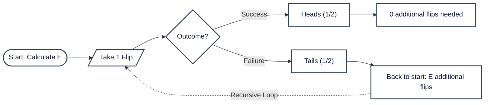

# Probability & Statistics

- My statistics is so bad back in high school so I never attempted to touch it until now. However, an inevitable motivation is here. A proper perception and prediction computer vision engineer must be able to use them, so I must learn it! 
- This note contains what I’ve learned before (a small, small amount) and what I’m going to learn (a big amount I hope). 
- Created on 12/29/2025

## Fundamentals

- **Sample space** $S$: the total number of possibilities
- **Event** $E$: a **set**, the collection of outcomes (probability operates on events, not individual outcomes)
- **General workflow**: Identify sample space ➡️ Define events ➡️ Apply the laws

### Three axioms

1. Probabilities can’t be negative: $P(E) \geq 0$. 
2. Something must happen: $P(S) = 1$. 
3. If events can’t overlap, just add: $P(A \cup B) = P(A) + P(B)$. 

### Basic operations

- the **NOT** operation: 

  - There’re only two possibilities, event A happens or not. 
  - **the compliment rule**: $P(A^c) = 1 - P(A)$. 

- the **AND** operation:

  - Find the two sets’ **intersection**: $P(A \cap B)$.

- the **OR** operation:

  - Mind the overlaps! 
  - **the addition rule**: $P(A \cup B) = P(A) + P(B) - P(A \cap B)$. 

  - If two events can’t overlap: $P(A \cap B) = 0$

### Factorials

- **n factorial** 
- $n! = n \times (n-1) \times (n-2) \times ... \times 2 \times 1$ 

### Basic conditions

- If **repetition allowed**: $P(E) = n^k$. 
  - e.g. 4-digit PIN from 0~9: $ k =4, n = 10, P(E) = 10^4 = 10000$

- If **no repetition + order matters**: Permutation $P(n,k)$. 
  - Formula: $P(n,k) = \frac{n!}{(n-k)!}$ 
  - But, $P(n,k)$ is basically multiply down $k$ times. 
  - e.g. $P(10,4) = 10 \times 9 \times 8 \times 7 = 5040$. 

- If **no repetition + order doesn’t matter**: Combination $P(n,k)$. 
  - Formula: $C(n,k) = \frac{n!}{k!\ (n-k)!}$ 
  - Also valid: $C(n,k) = P(n,k) \div k!$ (**Permutation divided by redundancy**)
  - e.g. $C(10,4) = P(10,4) \div 4! = 5040 \div 24 = 210$. 

### Conditional Probability

- Knowing more conditions means to **shrink the probability universe** more. 
- $P(A|B) = P(A \cap B)/P(B)$  
  - (“|” means “Given that”). 
  - $P(A \cap B)$ = A **AND** B = all outcomes where both A and B happen, **within** the $P(B)$ universe. 
  - $P(B)$ = all outcomes where B happens. **This is the new, smaller universe**. 

- E.g. 10 Marbles, 5 blue, 5 red. First marble drawn: blue. Now what’s the probability that second is red?
- P(second is Red | first was Blue) = P(Blue first AND Red second) / P(Blue first) = (5/10 x 5/9) / (5/10) = 5/9

### Marginal Probability

- A marginal probability is the sum of the joint probabilities. 

### Independent Events

- Independence means: A doesn’t cause B, B doesn’t cause A, no hidden factors affects both. 
- **Always check independence** before calculating **AND**. 
- 3 ways to test **independence**: 
  1. Check if $P(A \text{ AND } B) = P(A) \times P(B)$. 
  2. Check if $P(A|B) = P(A)$. 
  3. Check if knowing B doesn’t change your belief about A. 

- If independent: just multiply $P(A) \times P(B)$. 
- If dependent: use conditional probability: $P(A) \times P(B|A)$. 

### Random Variables

- A random variable is **a function that assigns a number** to every outcome in your sample space. 
- Example: flip a coin twice, head wins \$3, tail lose \$2. 
  - Sample space $S = \{\text{HH, HT, TH, TT}\}$
  - HH = \$6, HT or TH = \$1, TT = -\$4. 
  - So random variable X takes values $\{6,1,-4\}$. 

### Expected Value

- E[X], the average value in the long run. 
- **Expected value always add**, whenever they’re dependent or not. 
  - E[X + Y] = E[X] + E[Y], for any random variables. 
- **Linearity of Expectation**: Even though X and Y are completely dependent, when we break apart the math and regroup it, the dependencies automatically washed out. We end up with the original marginal probabilities. 

### Discrete and Continuous

- Discrete variables
  - use **PMF - Probability Mass Function**. 
  - Add up probabilities.
  - P(X = x): probability equals specific value. 
  - E.g. picking marbles, rolling dices
- Continuous variables 
  - use **PDF - Probability Density Function**. 
  - Integrate to find areas - measuring a continuous range. 
  - We can’t ask P(X = x), they’re always **zero** (infinite results gives infinite small probabilities). 

### Law of Total Probability

$P(A) = \sum{P(A|B_i) \times P(B_i)}$ for all possible scenario $B_i$. 

- This basically means break the problem into all possible paths, calculate each path’s probability, add them up. 

### Baye’s Rule

$P(A|B) = \frac{P(B|A) \times P(A)}{P(B)}$ 

- Always account for the **base rate** - how common the condition is. 

Example: Bag A has 5 red, 5 blue; Bag B has 1 red, 7 blue. 70% chance pick Bag A, 30% chance pick Bag B. What’s P(Bag A|blue)

- Initial chance: **P(Bag A)** = 70%

- Chance of blue given Bag A: **P(blue|Bag A)** = 50%

- Total chance of blue: **P(blue)** = P(blue|Bag A) + P(blue|Bag B) = 70% x 50% + 30% x 87.5% = 61.25% (law of probability)

- So, P(Bag A|blue) 

  = total chance of the “**Bag A then blue” pathway** / total chance of blue 

  =  (**P(blue|Bag A) x P(Bag A)**) / P(blue) 

  = 50% x 70% / 61.25% 

  ~= 57.1%

### Recursive Problems

Example 1: By flipping a coin, how many flips do you expect to need before getting your first heads?

- E = 1 flip you definitely take + expected additional flips

​	= 1 + (1/2)(0) + (1/2)(E)

​	= 1 + E/2

- E = 2, meaning that I expect exactly 2 flips to get the first heads. 

Example 2: How many flips do you expect to need before getting HH?

- E = expected flips starting from scratch
- E_H = expect additional flips after getting one H

- From scratch: E = 1 + (1/2)(E) + (1/2)(E_H)
- From one H: E_H = 1 + (1/2)(E) + (1/2)(0)

## Reference

- [Give Me 1 Hour, I'll Make Probability Click Forever by Zachary Huang - Youtube](https://youtu.be/H6pWY2VQ9xI?si=rPtFx9PvDhdGJzZo)
- 